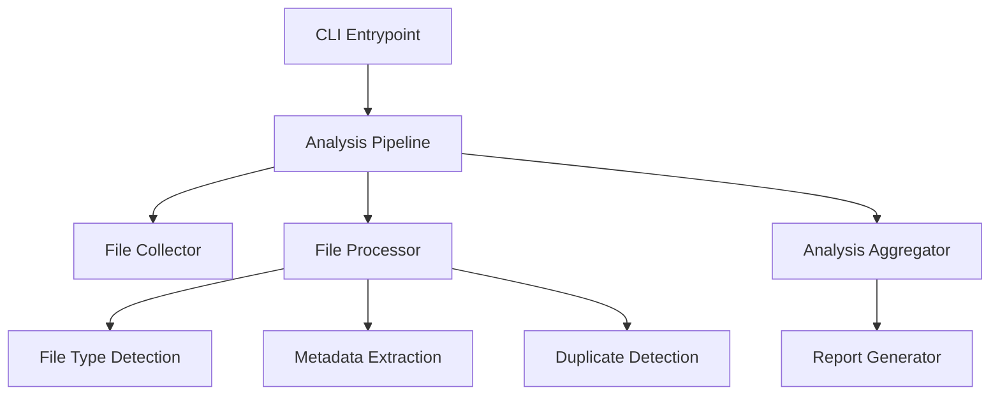

<think>
Okay, the user wants to rewrite their existing Bash script into Go, focusing on the architecture, design patterns, and interfaces. Let me start by understanding the original script's functionality.

The Bash script analyzes the Downloads folder, using tools like Magika, ExifTool, and jdupes. It collects statistics, file types, duplicates, media metadata, recent files, large files, and organizes files by month. The output is a text report with recommendations.

Now, translating this to Go requires considering Go's strengths and idiomatic practices. The user mentioned using interfaces, so I should identify areas where interfaces can abstract different implementations. For example, file type detection might have multiple backends (Magika, file command, etc.).

Design patterns come into play here. The Strategy pattern could be useful for interchangeable components, like different file type detectors. The Factory pattern might help in creating these strategies based on availability. The Visitor pattern could traverse the file system and process each file, collecting data.

Error handling in Go is explicit, so each component should return errors appropriately. Concurrency is a big plus in Go. Using goroutines and channels can parallelize tasks like file processing, which would speed up the analysis compared to the sequential Bash script.

The user's custom guidelines mention using errgroup for goroutines, so I'll structure concurrent parts with errgroup.Group. Also, they prefer using context for cancellation and timeouts, so passing context through functions is necessary.

For the architecture, breaking down the script into modular components makes sense. Separating concerns into packages like core, analyzers, reporters, and organizers. Each package handles a specific part of the analysis.

Interfaces to define contracts: a FileTypeDetector interface with Detect method, a MetadataExtractor for media files, a DuplicateFinder for duplicates. This allows swapping implementations without changing the core logic.

The pipeline approach would structure the process into stages: collection, analysis, reporting. Each stage can be handled by different modules, possibly in parallel.

Logging and configuration are important. Using the slog package for structured logging, and a Config struct to handle settings like sample limits, thresholds, and tool paths.

Testing is crucial. Each component should have unit tests, and integration tests to ensure the system works as a whole. Mock implementations for dependencies like Magika or ExifTool will help in testing.

Performance considerations: caching results where possible, using efficient data structures like maps for counts and sizes, and avoiding unnecessary allocations.

I should also consider the user's guidelines, like using cobra for CLI apps, which aligns with making the Go version a command-line tool. The architecture should be scalable, allowing new analyzers or reporters to be added easily.

Potential challenges include handling large directories efficiently, ensuring concurrent processing doesn't race, and managing external tool dependencies. Wrapping external tools in Go commands with timeouts and proper error handling will be necessary.

In summary, the Go architecture should modularize the Bash script's functionality into reusable, testable components using interfaces and design patterns, leverage concurrency for performance, and adhere to Go best practices and the user's specific guidelines.
</think>

Here's a proposed Go architecture for rewriting the Downloads folder analysis script using Go idioms and design patterns:

# Downloads Analyzer Architecture

## Core Components


## Key Design Patterns

1. **Pipeline Pattern**
   - `Collect -> Process -> Analyze -> Report` stages
   - Each stage implements `PipelineStage` interface:
```go
type PipelineStage interface {
    Execute(ctx context.Context, data *AnalysisData) error
    Name() string
}
```

2. **Strategy Pattern** for interchangeable components:
   - File type detection (Magika vs file command fallback)
   - Duplicate detection (jdupes vs native Go implementation)
   - Metadata extraction (ExifTool vs Go-native EXIF libraries)

3. **Visitor Pattern** for file system traversal:
```go
type FileVisitor interface {
    VisitFile(path string, info os.FileInfo) error
    VisitDir(path string, info os.FileInfo) error
}
```

4. **Factory Pattern** for detector implementations:
```go
type DetectorFactory interface {
    Create(config Config) (FileTypeDetector, error)
}
```

## Core Interfaces

1. File Type Detection
```go
type FileTypeDetector interface {
    Detect(ctx context.Context, path string) (FileTypeResult, error)
}

type FileTypeResult struct {
    MIMEType string
    FileType string 
    Group    string
}
```

2. Metadata Extraction
```go
type MetadataExtractor interface {
    ExtractMediaMetadata(ctx context.Context, path string) (MediaMetadata, error)
}

type MediaMetadata struct {
    Resolution  string
    Duration    time.Duration
    Created     time.Time
    CameraModel string
}
```

3. Duplicate Detection
```go
type DuplicateFinder interface {
    FindDuplicates(ctx context.Context, paths []string) ([]DuplicateSet, error)
}

type DuplicateSet struct {
    Files         []string
    TotalSize     int64
    WastedSpace   int64
    Hash          string
}
```

## Package Structure

```
/cmd
  /downloads-analyzer
    main.go // CLI entrypoint
/internal
  /core
    pipeline.go       // Pipeline orchestration
    analysis_data.go  // Shared data structure
  /collector
    file_collector.go // Recursive file collection
  /processor
    file_processor.go // Parallel file processing
  /analyzers
    type_analyzer.go
    duplicate_analyzer.go
    metadata_analyzer.go
  /reporters
    text_reporter.go
    json_reporter.go
  /organizers
    time_organizer.go
    type_organizer.go
/pkg
  /detection
    magika_detector.go
    file_detector.go
  /metadata
    exiftool_extractor.go
    native_extractor.go
  /duplicates
    jdupes_finder.go
    hash_finder.go
```

## Concurrency Model

1. **Worker Pool** for parallel file processing
2. **Fan-out/Fan-in** pattern for:
   - File type detection
   - Metadata extraction
   - Size calculation
3. **ErrGroup** with context for coordinated error handling

## Key Data Structures

```go
type AnalysisData struct {
    Config Config
    
    // File metadata
    Files         []FileMeta
    FileTypes     map[string]TypeSummary
    LargeFiles    []FileMeta
    RecentFiles   []FileMeta
    
    // Analysis results
    Duplicates   []DuplicateSet
    MediaFiles   []MediaFile
    SizeByMonth  map[string]MonthSummary
}

type FileMeta struct {
    Path         string
    Size         int64
    ModTime      time.Time
    Type         FileTypeResult
    MediaData    MediaMetadata
    Hash         string
}
```

## Error Handling Strategy

1. **Sentinel Errors** for common failure modes
```go
var (
    ErrToolMissing = errors.New("required external tool missing")
    ErrTimeout     = errors.New("analysis timed out")
)
```

2. **Error Wrapping** with github.com/pkg/errors
3. **Recovery Middleware** for pipeline stages
4. **Circuit Breaker** pattern for external tool calls

## Configuration Management

```go
type Config struct {
    // Pipeline configuration
    Parallelism     int
    SamplePerDir    int
    MaxFileSize     int64
    
    // External tools
    MagikaPath      string
    ExifToolPath    string
    JdupesPath      string
    
    // Thresholds
    LargeFileThreshold int64
    RecentDays         int
}
```

## Observability

1. **Structured Logging** using slog
2. **Metrics Collection** for:
   - Files processed/sec
   - Memory usage
   - Stage durations
3. **Tracing** context propagation through pipeline

## Testing Strategy

1. **Golden Files** for report validation
2. **Mock Implementations** for:
   - File system
   - External tools
3. **Fuzz Testing** for file path handling
4. **Benchmark Tests** for performance-critical paths

## Security Considerations

1. **Sandboxing** for external tool execution
2. **Path Sanitization** for all file operations
3. **Rate Limiting** for parallel processing
4. **Memory Limits** for large file handling

Would you like me to elaborate on any particular component or discuss implementation details for specific patterns?
