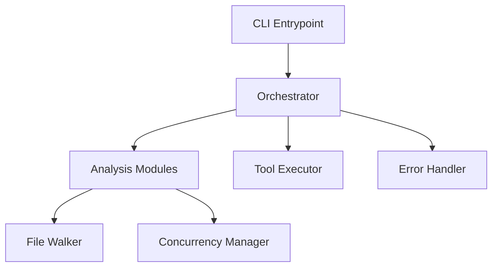
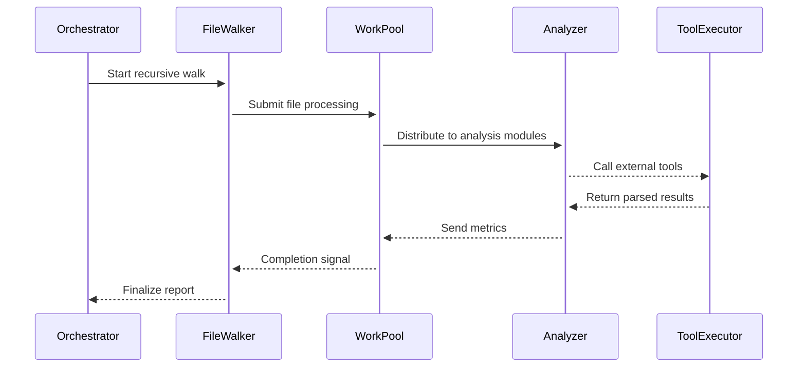

<think>
Okay, I need to create a Go architecture design for rewriting the given Bash script into Go. Let me start by understanding what the original script does.

The Bash script analyzes the Downloads folder, collecting statistics, file types, duplicates, media metadata, and more. It uses tools like Magika, ExifTool, and jdupes. The goal is to translate this functionality into Go, using appropriate design patterns and interfaces.

First, I'll outline the main components. The original script has several sections: basic stats, file type analysis, media analysis, duplicates, recent files, large files, and recommendations. Each of these can be a module in Go.

For design patterns, the Facade pattern makes sense to simplify interactions with external tools. Maybe a ToolExecutor interface to handle different tools like Magika or ExifTool. The Strategy pattern could be useful for different analysis modules, allowing them to be pluggable.

Interfaces are important for flexibility. An Analyzer interface with methods like Analyze() and Report() would standardize each module. Also, a FileWalker interface could abstract file traversal, handling concurrency and errors.

Concurrency is a big consideration. Go's goroutines and channels can parallelize file processing. Using an errgroup to manage goroutines and collect errors would be efficient. I should structure the code to process files in parallel but aggregate results safely.

Error handling needs to be robust. Wrapping errors with github.com/pkg/errors for context. Maybe a central error handler that logs and decides whether to continue or abort.

Logging and metrics are essential. Using a structured logger like log/slog or zerolog. Metrics can track processed files, durations, and errors, which can be exposed via Prometheus or OpenTelemetry.

Configuration management should use environment variables and config files. Viper could help here, allowing settings like concurrency limits, paths, and tool paths to be easily adjusted.

For the CLI, Cobra is a good choice. It supports subcommands and flags, which aligns with the script's options like --verbose and --sample-per-dir.

Testing each component in isolation is crucial. Mocking external tools and using table-driven tests for different scenarios. Integration tests with sample directories would ensure the system works as a whole.

Putting it all together, the architecture would have a core orchestrator that coordinates modules, handles concurrency, and generates the report. Each analysis module (stats, media, duplicates) implements the Analyzer interface. The ToolExecutor facade interacts with external binaries, handling timeouts and output parsing.

I should also consider fallbacks, like using Go's built-in file type detection if Magika isn't available. For duplicates, maybe a hashing strategy in Go instead of relying on jdupes, but allow using jdupes if present.

Finally, the report generation should be modular, allowing different formats (text, JSON, HTML) in the future. Using templates or a builder pattern for the report structure.

I need to make sure all these components are decoupled, testable, and follow Go best practices. Using interfaces where possible to allow swapping implementations without changing the core logic.
</think>

Here's a proposed Go architecture for rewriting the Downloads folder analysis script using modern Go patterns and best practices:

# Downloads Analyzer Architecture (Go)

## Core Components


## Key Design Patterns

1. **Facade Pattern** (`ToolExecutor`)
   - Unified interface for external tools (Magika, exiftool, jdupes)
   - Handles tool availability checks, command execution, and output parsing
   - Implements timeout and retry logic

2. **Strategy Pattern** (Analysis Modules)
   ```go
   type Analyzer interface {
       Analyze(ctx context.Context, file FileInfo) error
       Report() AnalysisResult
       Name() string
   }
   ```
   - Implementations:
     - `TypeAnalyzer` (Magika/file detection)
     - `MediaAnalyzer` (EXIF/metadata)
     - `DuplicateAnalyzer` (jdupes/MD5)
     - `TimelineAnalyzer` (modification dates)
     - `SizeAnalyzer` (large files)

3. **Observer Pattern** (Progress Reporting)
   ```go
   type ProgressReporter interface {
       Update(status AnalysisStatus)
       Error(err error)
   }
   ```

4. **Builder Pattern** (Report Generation)
   ```go
   type ReportBuilder struct {
       buffer strings.Builder
   }
   
   func (rb *ReportBuilder) AddSection(title string, data interface{}) 
   func (rb *ReportBuilder) FormatTable(headers []string, rows [][]string)
   ```

## Core Interfaces

1. **File Processing**
```go
type FileWalker interface {
    Walk(root string, fn func(FileInfo) error) error
    Sample(dir string, max int) []FileInfo
}

type FileInfo struct {
    Path     string
    Size     int64
    ModTime  time.Time
    IsDir    bool
    // ... other metadata
}
```

2. **Concurrency Management**
```go
type WorkPool interface {
    Submit(task func() error)
    Wait() error // Uses errgroup
    SetConcurrency(workers int)
}
```

3. **Error Handling**
```go
type ErrorHandler interface {
    Handle(err error, context string) bool // Returns true if should continue
    GetStats() ErrorStats
}

type ErrorStats struct {
    Total      int
    ByType     map[error]int
    Recovered  int
    Fatal      int
}
```

## Module Structure

```
/cmd
  /downloads-analyzer
    main.go          // CLI entrypoint
/internal
  /core
    orchestrator.go  // Coordinates analysis flow
  /analysis
    /types           // File type analysis
    /media           // EXIF/metadata 
    /duplicates      // Duplicate detection
  /utils
    filewalk.go      // Concurrent file traversal
    reporting.go     // Report generation
/pkg
  /tooling           // External tool integration
  /config            // Configuration management
```

## Concurrency Model



## Key Decisions

1. **Error Handling Strategy**
   - Use `github.com/pkg/errors` for error wrapping
   - Three error tiers:
     - Recoverable (log and continue)
     - Warning (include in report)
     - Fatal (immediate exit)

2. **Memory Management**
   - Streaming processing where possible
   - Size-based chunking for large directories
   - LRU cache for duplicate detection

3. **Cross-Platform Support**
   - Build tags for OS-specific implementations
   - Filesystem abstraction layer
   - Configurable tool paths

4. **Extensibility**
   - Analysis modules register via init()
   - Plugin system for custom reporters
   - Configurable concurrency per module

## Recommended Packages

1. **Concurrency** 
   - `golang.org/x/sync/errgroup`
   - `github.com/panjf2000/ants` (worker pool)

2. **CLI**
   - `github.com/spf13/cobra`
   - `github.com/spf13/viper`

3. **Logging**
   - Structured logging with `log/slog`
   - Rotating logs with `github.com/lestrrat-go/file-rotatelogs`

4. **Metrics**
   - Prometheus metrics with `github.com/prometheus/client_golang`
   - OpenTelemetry tracing

Would you like me to elaborate on any particular component or discuss implementation details for specific modules?
