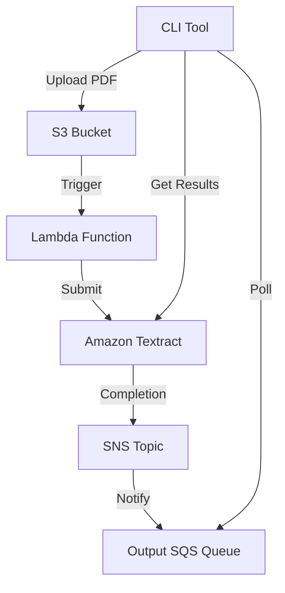
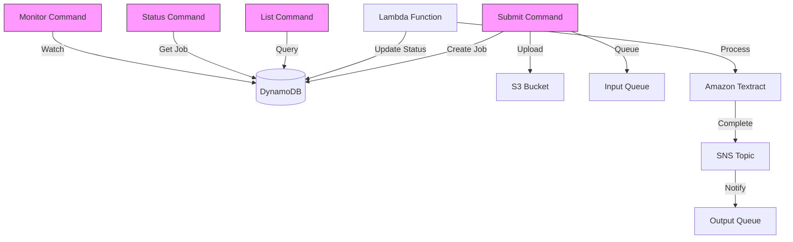
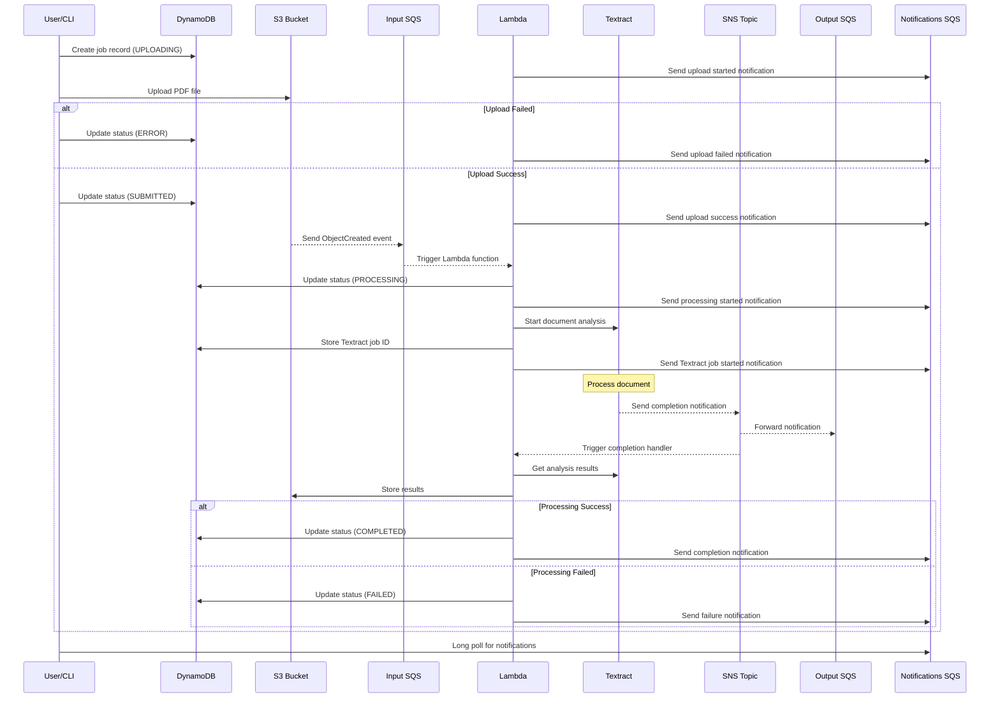
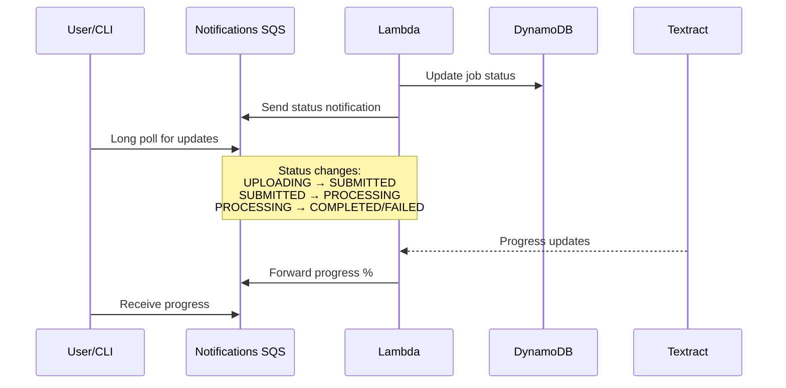
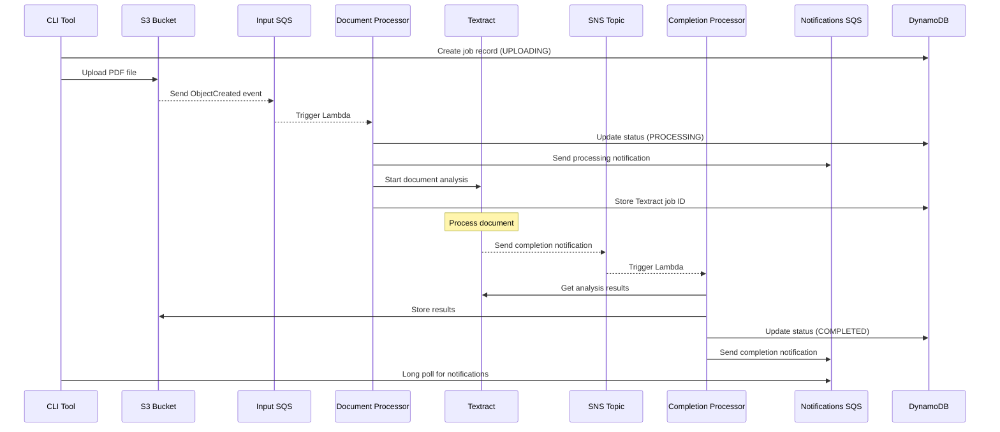

textrator is an application to submit PDFs to textract and get back structured data.

## Resources

The way it works is that there is a terraform module that configures the following resources:

- S3 bucket
- Two SQS queues:
  - Input queue: Handles new document processing requests
  - Output queue: Receives Textract completion notifications
- SNS topic: Receives Textract completion notifications
- Lambda function
- EventBridge rule to trigger the lambda function on new files in the S3 bucket

See terraform/README.md for more details.

### Storage
- **S3 Bucket**: Stores input PDFs and potentially processed results
- **Input SQS Queue**: Buffers new document processing requests
- **Output SQS Queue**: Buffers Textract completion notifications
- **SNS Topic**: Handles Textract completion notifications


### Processing
- **Lambda Function**: Orchestrates document processing
- **Amazon Textract**: Performs document analysis
- **EventBridge Rule**: Triggers Lambda on new S3 uploads


The lambda function is configured to use the `textract:AnalyzeDocument` API to extract the text from the PDF.

## Workflow

The workflow is:
1. Go program uploads PDF to S3
2. S3 event triggers Lambda via input queue
3. Lambda submits document to Textract
4. Textract processes document and sends completion notification to SNS
5. SNS forwards notification to output queue
6. Go program polls output queue for results
7. When notification received, program calls textract:GetDocumentAnalysis API

## Jobs and Job Orchestration

### Job Structure
Each document processing request is tracked as a job with the following metadata:

```go
type TextractJob struct {
  JobID string // Unique identifier
  DocumentKey string // S3 key of the original PDF
  Status string // UPLOADING, SUBMITTED, PROCESSING, COMPLETED, FAILED, ERROR
  SubmittedAt time.Time
  CompletedAt time.Time
  TextractID string // AWS Textract Job ID
  ResultKey string // S3 key where results are stored
  Error string // Error message if failed
}
```

### Job States

1. UPLOADING: Initial state when job is created and file upload begins
2. SUBMITTED: File successfully uploaded to S3, ready for processing
3. PROCESSING: Document is being processed by Textract
4. COMPLETED: Processing finished successfully
5. FAILED: Textract processing failed
6. ERROR: System error occurred (upload failed, etc.)

### Job Storage
Jobs are tracked in DynamoDB with the following structure:
- Table: TextractorJobs
- Partition Key: JobID
- GSI1: Status-SubmittedAt (for efficient listing by status)
- GSI2: DocumentKey (for looking up jobs by original document)

This design allows:
- Efficient queries by status
- Easy updates as job status changes
- Serverless and scalable operation
- Built-in TTL for old job cleanup

### Job Lifecycle

1. Document Submission:
   - Generate unique JobID
   - Create job record in DynamoDB (status: UPLOADING)
   - Upload PDF to S3
   - On successful upload, update status to SUBMITTED
   - On upload failure, update status to ERROR with error message

2. Processing:
   - Lambda receives message from input queue
   - Updates job status to PROCESSING
   - Submits document to Textract
   - Textract processes document
   - SNS notification sent upon completion

3. Completion:
   - Lambda receives completion notification via SNS/SQS
   - Updates job status to COMPLETED
   - Stores Textract results in S3
   - Updates job record with result location

4. Error Handling:
   - If processing fails, status updated to FAILED
   - If system error occurs, status updated to ERROR
   - Error message stored in job record
   - Allows for retry mechanisms and debugging

### Job Management Commands
The CLI provides several commands for job management:
- `list`: Query and display jobs with filtering options
- `status`: Check individual job status
- `purge`: Clean up old jobs and associated data
- `monitor`: Watch job processing in real-time

This job orchestration system ensures reliable tracking of document processing requests and provides visibility into the processing pipeline.

## Architecture Diagrams

### Infrastructure Flow


### Job Management Flow


The diagrams show:
1. The infrastructure flow demonstrates how documents move through the AWS services
2. The job management flow shows how the CLI commands interact with DynamoDB for job tracking while processing occurs

## Detailed Processing Flow



### Notification Types

1. Job Status Updates:
   - `UPLOAD_STARTED`: Initial job creation
   - `UPLOAD_FAILED`: Upload to S3 failed
   - `UPLOAD_COMPLETED`: File successfully uploaded
   - `PROCESSING_STARTED`: Textract analysis started
   - `PROCESSING_COMPLETED`: Analysis finished successfully
   - `PROCESSING_FAILED`: Analysis failed

2. Progress Updates:
   - `TEXTRACT_PROGRESS`: Periodic progress updates
   - `PAGE_PROCESSED`: Individual page completion
   - `OPERATION_STARTED`: Start of specific operation (tables, forms, etc.)
   - `OPERATION_COMPLETED`: Completion of specific operation

3. Error Notifications:
   - `SYSTEM_ERROR`: Infrastructure/system errors
   - `VALIDATION_ERROR`: Document validation issues
   - `PROCESSING_ERROR`: Textract processing errors

### Notification Message Format

```json
{
  "type": "STATUS_UPDATE",
  "jobId": "job-123",
  "status": "PROCESSING",
  "timestamp": "2024-03-21T15:04:05Z",
  "message": "Started Textract analysis",
  "progress": 0.45,
  "details": {
    "pagesProcessed": 5,
    "totalPages": 10,
    "currentOperation": "table_detection",
    "error": "Error message if applicable"
  }
}
```

## Progress Notifications

### Recommended Approach: New Notifications Queue

We recommend implementing a dedicated notifications queue for progress updates:



### Notification Message Structure
```json
{
  "type": "STATUS_UPDATE",
  "jobId": "job-123",
  "status": "PROCESSING",
  "timestamp": "2024-03-21T15:04:05Z",
  "message": "Started Textract analysis",
  "progress": 0.45,  // Optional
  "details": {       // Optional
    "pagesProcessed": 5,
    "totalPages": 10,
    "currentOperation": "table_detection"
  }
}
```

### Implementation Requirements

1. New SQS Queue:
```hcl
resource "aws_sqs_queue" "notifications" {
  name = "${var.prefix}-notifications"
  visibility_timeout_seconds = 30
  message_retention_seconds = 3600  // 1 hour retention
  receive_wait_time_seconds = 20    // Enable long polling
}
```

2. Lambda Updates:
- Send notifications for all status changes
- Forward Textract progress updates
- Include detailed error information
- Add operation-specific details

3. Client Features:
- Long-polling for notifications
- Progress bar support
- Timeout and retry handling
- Filtering by job ID

### Benefits of This Approach

1. **Clean Architecture**
   - Separates progress monitoring from core processing
   - Allows for future expansion (webhooks, email)
   - Won't impact core processing reliability

2. **Flexibility**
   - Can adjust retention and visibility independently
   - Easy to add new notification types
   - Can implement fan-out patterns

3. **Performance**
   - Long-polling reduces API calls
   - No impact on core queues
   - Can scale independently

4. **Cost Control**
   - Shorter retention period than core queues
   - Can be disabled without affecting core functionality
   - Pay only for actual notification volume

### Client Implementation Example
```go
type NotificationPoller struct {
    sqs         *sqs.SQS
    queueURL    string
    jobID       string
    maxWaitTime int64
}

func (p *NotificationPoller) Poll(ctx context.Context) (<-chan Notification, error) {
    ch := make(chan Notification)
    
    go func() {
        defer close(ch)
        
        for {
            select {
            case <-ctx.Done():
                return
            default:
                msgs, err := p.sqs.ReceiveMessageWithContext(ctx, &sqs.ReceiveMessageInput{
                    QueueUrl:            aws.String(p.queueURL),
                    WaitTimeSeconds:     aws.Int64(p.maxWaitTime),
                    MaxNumberOfMessages: aws.Int64(10),
                    MessageAttributeNames: []*string{
                        aws.String("jobId"),
                    },
                })
                
                if err != nil {
                    log.Printf("Error polling notifications: %v", err)
                    time.Sleep(time.Second)
                    continue
                }
                
                for _, msg := range msgs.Messages {
                    // Filter for specific jobId if set
                    if p.jobID != "" && msg.MessageAttributes["jobId"].StringValue != p.jobID {
                        continue
                    }
                    
                    var notif Notification
                    if err := json.Unmarshal([]byte(*msg.Body), &notif); err != nil {
                        log.Printf("Error parsing notification: %v", err)
                        continue
                    }
                    
                    ch <- notif
                    
                    // Delete processed message
                    _, err := p.sqs.DeleteMessage(&sqs.DeleteMessageInput{
                        QueueUrl:      aws.String(p.queueURL),
                        ReceiptHandle: msg.ReceiptHandle,
                    })
                    if err != nil {
                        log.Printf("Error deleting message: %v", err)
                    }
                }
            }
        }
    }()
    
    return ch, nil
}
```

# Lambda Functions

The application uses two Lambda functions for better separation of concerns:

## Document Processor Lambda
Handles new document submissions via SQS from S3 events:
1. Receives S3 event via SQS
2. Updates job status to PROCESSING
3. Submits document to Textract
4. Updates job with Textract ID
5. Sends notifications about processing start

Permissions:
- SQS: Read from input queue
- S3: Read uploaded documents
- Textract: Start analysis
- DynamoDB: Update job status
- SNS: Send notifications

## Completion Processor Lambda
Handles Textract completion notifications via SNS:
1. Receives completion notification from SNS
2. Retrieves full analysis results from Textract
3. Stores results in S3
4. Updates job status in DynamoDB
5. Sends completion notification

Permissions:
- SNS: Receive notifications
- Textract: Get analysis results
- S3: Write results
- DynamoDB: Update job status
- SQS: Send notifications

# Event Flow

