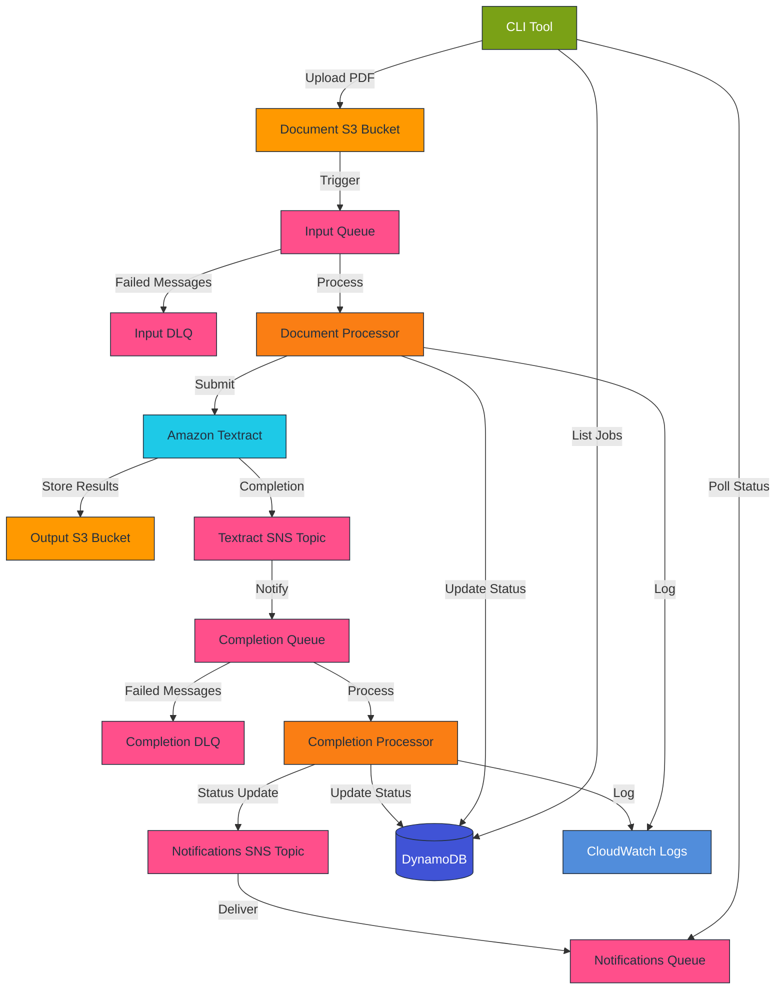

# Textractor

Textractor is an application to submit PDFs to AWS Textract and get back structured data.

## Architecture Overview

The application uses a serverless architecture with the following AWS resources:

### Storage Components
- **S3 Buckets**: 
  - Document bucket: Stores input PDFs
  - Output bucket: Stores Textract results
  - Both buckets configured with proper Textract service permissions
- **Input SQS Queue**: Buffers new document processing requests
  - 30s visibility timeout
  - 24h message retention
  - Dead Letter Queue with 14-day retention and 3 retries
- **Completion SQS Queue**: Receives Textract completion notifications
  - 30s visibility timeout
  - 24h message retention
  - Dead Letter Queue with 14-day retention and 3 retries
- **SNS Topics**: 
  - Textract completion notifications
  - Application notifications for status updates
  - CloudWatch logging enabled with 14-day retention
- **Notifications SQS Queue**: Provides real-time status updates
  - 1-hour message retention
  - Long polling enabled (20s wait time)
  - Used for monitoring job progress

### Processing Components
- **Document Processor Lambda**: 
  - Handles new document submissions
  - Node.js implementation
  - 30s timeout
  - CloudWatch logging enabled
  - IAM role with S3, Textract, and SNS permissions
- **Completion Processor Lambda**: 
  - Processes Textract completion notifications
  - Node.js implementation
  - 30s timeout
  - CloudWatch logging enabled
- **Amazon Textract**: Performs document analysis
  - Configured with SNS notifications
  - IAM role for S3 access and SNS publishing
- **DynamoDB**: Tracks job status and metadata
  - Table: TextractorJobs
  - Partition Key: JobID (String)
  - GSI1: Status-SubmittedAt-Index for status queries
  - GSI2: DocumentKey-Index for file lookups
  - Point-in-time recovery enabled
  - TTL enabled for automatic cleanup

## Processing Workflow

1. Go CLI uploads PDF to S3 document bucket
2. S3 event triggers Document Processor Lambda via input queue
3. Document Processor:
   - Updates job status to PROCESSING
   - Submits document to Textract
   - Configures SNS notification
4. Textract processes document asynchronously
5. On completion, Textract sends notification to SNS topic
6. Completion Processor Lambda:
   - Retrieves Textract results
   - Stores results in output bucket
   - Updates job status to COMPLETED
   - Sends notification to status queue
7. CLI polls notifications queue for updates
8. Failed messages are moved to DLQ after 3 retries

## Job Management

### Job Structure
```go
type TextractJob struct {
    JobID        string     // Unique identifier
    DocumentKey  string     // S3 key of the original PDF
    Status       string     // Current processing status
    SubmittedAt  time.Time  // When the job was created
    CompletedAt  *time.Time // When processing finished (if completed)
    TextractID   string     // AWS Textract Job ID
    ResultKey    string     // S3 key where results are stored
    Error        string     // Error message if failed
}
```

### Job States
1. UPLOADING: Initial state when job is created
2. SUBMITTED: File uploaded to S3, ready for processing
3. PROCESSING: Document being analyzed by Textract
4. COMPLETED: Processing finished successfully
5. FAILED: Textract processing failed
6. ERROR: System error occurred

### Job Storage
Jobs are tracked in DynamoDB with the following structure:
- Table: TextractorJobs
- Partition Key: JobID (String)
- GSI1: Status-SubmittedAt-Index
  - Hash Key: Status (String)
  - Range Key: SubmittedAt (String)
- GSI2: DocumentKey-Index
  - Hash Key: DocumentKey (String)
- TTL: Enabled (attribute: TTL)
- Point-in-time Recovery: Enabled

Benefits:
- Efficient queries by status and time range
- Easy updates as job status changes
- Serverless and scalable operation
- Built-in TTL for old job cleanup
- Backup and recovery capabilities

### CLI Commands
The application provides the following commands:
- `submit [file/directory]`: Submit PDFs for processing
  - Supports single file or recursive directory processing
  - Generates unique job IDs
  - Creates initial job records
- `list`: List and filter jobs
  - Filter by status
  - Filter by date range
  - Sort by submission time
- `debug`: Debugging tools
  - Lambda function logs
  - Queue monitoring
  - S3 operations
  - SNS topic inspection
  - CloudWatch metrics
  - End-to-end testing
- `save-config`: Save Terraform state to config file

## Infrastructure Management

### Terraform Module Structure
- `main.tf`: Provider configuration
- `variables.tf`: Input variables
- `outputs.tf`: Resource outputs
- `s3.tf`: S3 bucket configuration
- `sqs.tf`: Queue definitions
- `sns.tf`: Topic configuration
- `lambda.tf`: Function deployment
- `dynamodb.tf`: Table schema
- `textract.tf`: Textract IAM roles
- `cloudwatch.tf`: Logging setup

### Resource Naming
All resources use a consistent naming scheme:
- Prefix: {prefix}-{resource}
- Environment tag
- Standard tags for all resources

### Monitoring & Logging
- CloudWatch Log Groups:
  - Lambda function logs
  - SNS delivery logs
  - CloudTrail audit logs
- CloudWatch Metrics:
  - Lambda execution metrics
  - Queue depth monitoring
  - SNS delivery statistics
- Dead Letter Queues:
  - Separate DLQs for input and completion
  - 14-day message retention
  - Monitoring via debug commands

## Progress Notifications

### Notification Types
1. Job Status Updates:
   - UPLOAD_STARTED: Initial job creation
   - UPLOAD_COMPLETED: File successfully uploaded
   - PROCESSING_STARTED: Textract analysis started
   - PROCESSING_COMPLETED: Analysis finished successfully
   - PROCESSING_FAILED: Analysis failed

2. Progress Updates:
   - TEXTRACT_PROGRESS: Periodic progress updates
   - PAGE_PROCESSED: Individual page completion
   - OPERATION_STARTED: Start of specific operation
   - OPERATION_COMPLETED: Completion of specific operation

3. Error Notifications:
   - SYSTEM_ERROR: Infrastructure/system errors
   - VALIDATION_ERROR: Document validation issues
   - PROCESSING_ERROR: Textract processing errors
   - DLQ_ERROR: Message processing failures

### Notification Message Format
```json
{
  "type": "STATUS_UPDATE",
  "jobId": "job-123",
  "status": "PROCESSING",
  "timestamp": "2024-03-21T15:04:05Z",
  "message": "Started Textract analysis",
  "progress": 0.45,
  "details": {
    "pagesProcessed": 5,
    "totalPages": 10,
    "currentOperation": "table_detection",
    "error": "Error message if applicable",
    "dlqSource": "input|output",  // If message moved to DLQ
    "retryCount": 3              // Number of retry attempts
  }
}
```

## Architecture Diagrams

### Infrastructure Flow


The diagram shows:
- Complete data flow from CLI to final output
- All SQS queues including Dead Letter Queues
- Both S3 buckets (document and output)
- Both SNS topics (Textract completion and notifications)
- CloudWatch logging integration
- All major service interactions
- Color coding for different AWS services
