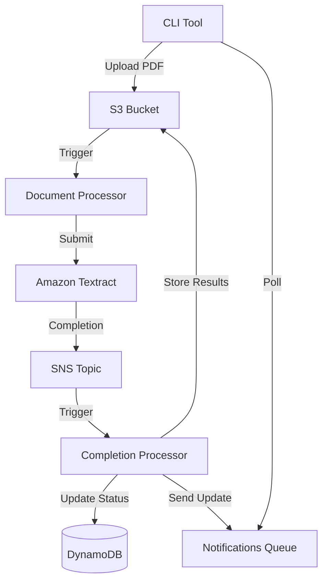
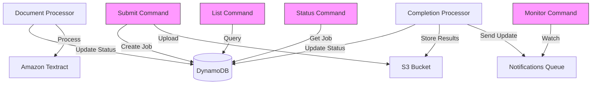

# Textractor

Textractor is an application to submit PDFs to AWS Textract and get back structured data.

## Architecture Overview

The application uses a serverless architecture with the following AWS resources:

### Storage Components
- **S3 Bucket**: Stores input PDFs and processed results
- **Input SQS Queue**: Buffers new document processing requests
  - Has associated Dead Letter Queue for failed messages
- **Output SQS Queue**: Receives Textract completion notifications
  - Has associated Dead Letter Queue for failed messages
- **SNS Topic**: Handles Textract completion notifications
- **Notifications SQS Queue**: Provides real-time status updates and progress information
  - 1-hour message retention
  - Long polling enabled (20s wait time)

### Processing Components
- **Document Processor Lambda**: Handles new document submissions
  - 30s timeout
  - Processes one message at a time
- **Completion Processor Lambda**: Processes Textract completion notifications
  - 30s timeout
- **Amazon Textract**: Performs document analysis
- **DynamoDB**: Tracks job status and metadata
  - Point-in-time recovery enabled
  - TTL enabled for automatic cleanup

## Processing Workflow

1. Go program uploads PDF to S3
2. S3 event triggers Document Processor Lambda via input queue
3. Document Processor submits document to Textract
4. Textract processes document and sends completion notification to SNS
5. SNS triggers Completion Processor Lambda
6. Completion Processor retrieves results and updates job status
7. Status updates sent to notifications queue
8. Go program polls notifications queue for progress
9. Failed messages are moved to DLQ after 3 retries

## Job Management

### Job Structure
```go
type TextractJob struct {
    JobID        string     // Unique identifier
    DocumentKey  string     // S3 key of the original PDF
    Status       string     // Current processing status
    SubmittedAt  time.Time  // When the job was created
    CompletedAt  *time.Time // When processing finished (if completed)
    TextractID   string     // AWS Textract Job ID
    ResultKey    string     // S3 key where results are stored
    Error        string     // Error message if failed
}
```

### Job States
1. UPLOADING: Initial state when job is created
2. SUBMITTED: File uploaded to S3, ready for processing
3. PROCESSING: Document being analyzed by Textract
4. COMPLETED: Processing finished successfully
5. FAILED: Textract processing failed
6. ERROR: System error occurred

### Job Storage
Jobs are tracked in DynamoDB with the following structure:
- Table: TextractorJobs
- Partition Key: JobID (String)
- GSI1: Status-SubmittedAt-Index
  - Hash Key: Status (String)
  - Range Key: SubmittedAt (String)
- GSI2: DocumentKey-Index
  - Hash Key: DocumentKey (String)
- TTL: Enabled (attribute: TTL)
- Point-in-time Recovery: Enabled

Benefits:
- Efficient queries by status and time range
- Easy updates as job status changes
- Serverless and scalable operation
- Built-in TTL for old job cleanup
- Backup and recovery capabilities

### Job Management Commands
The CLI provides several commands:
- `list`: Query and display jobs with filtering options
- `status`: Check individual job status
- `purge`: Clean up old jobs and associated data
- `monitor`: Watch job processing in real-time
- `debug dlq`: Inspect and manage Dead Letter Queues

## Progress Notifications

### Notification Types
1. Job Status Updates:
   - UPLOAD_STARTED: Initial job creation
   - UPLOAD_COMPLETED: File successfully uploaded
   - PROCESSING_STARTED: Textract analysis started
   - PROCESSING_COMPLETED: Analysis finished successfully
   - PROCESSING_FAILED: Analysis failed

2. Progress Updates:
   - TEXTRACT_PROGRESS: Periodic progress updates
   - PAGE_PROCESSED: Individual page completion
   - OPERATION_STARTED: Start of specific operation
   - OPERATION_COMPLETED: Completion of specific operation

3. Error Notifications:
   - SYSTEM_ERROR: Infrastructure/system errors
   - VALIDATION_ERROR: Document validation issues
   - PROCESSING_ERROR: Textract processing errors
   - DLQ_ERROR: Message processing failures

### Notification Message Format
```json
{
  "type": "STATUS_UPDATE",
  "jobId": "job-123",
  "status": "PROCESSING",
  "timestamp": "2024-03-21T15:04:05Z",
  "message": "Started Textract analysis",
  "progress": 0.45,
  "details": {
    "pagesProcessed": 5,
    "totalPages": 10,
    "currentOperation": "table_detection",
    "error": "Error message if applicable",
    "dlqSource": "input|output",  // If message moved to DLQ
    "retryCount": 3              // Number of retry attempts
  }
}
```


## Architecture Diagrams

### Infrastructure Flow


### Job Management Flow

