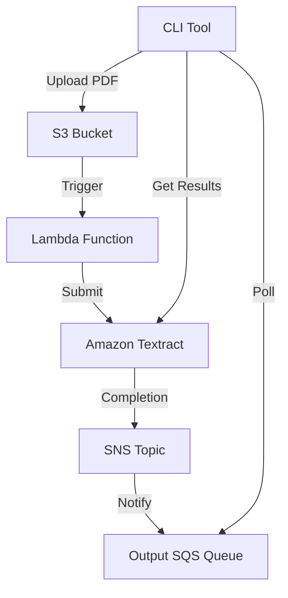
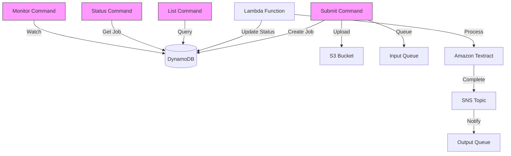

textrator is an application to submit PDFs to textract and get back structured data.

## Resources

The way it works is that there is a terraform module that configures the following resources:

- S3 bucket
- Two SQS queues:
  - Input queue: Handles new document processing requests
  - Output queue: Receives Textract completion notifications
- SNS topic: Receives Textract completion notifications
- Lambda function
- EventBridge rule to trigger the lambda function on new files in the S3 bucket

See terraform/README.md for more details.

### Storage
- **S3 Bucket**: Stores input PDFs and potentially processed results
- **Input SQS Queue**: Buffers new document processing requests
- **Output SQS Queue**: Buffers Textract completion notifications
- **SNS Topic**: Handles Textract completion notifications


### Processing
- **Lambda Function**: Orchestrates document processing
- **Amazon Textract**: Performs document analysis
- **EventBridge Rule**: Triggers Lambda on new S3 uploads


The lambda function is configured to use the `textract:AnalyzeDocument` API to extract the text from the PDF.

## Workflow

The workflow is:
1. Go program uploads PDF to S3
2. S3 event triggers Lambda via input queue
3. Lambda submits document to Textract
4. Textract processes document and sends completion notification to SNS
5. SNS forwards notification to output queue
6. Go program polls output queue for results
7. When notification received, program calls textract:GetDocumentAnalysis API

## Jobs and Job Orchestration

### Job Structure
Each document processing request is tracked as a job with the following metadata:

```go
go
type TextractJob struct {
  JobID string // Unique identifier
  DocumentKey string // S3 key of the original PDF
  Status string // SUBMITTED, PROCESSING, COMPLETED, FAILED
  SubmittedAt time.Time
  CompletedAt time.Time
  TextractID string // AWS Textract Job ID
  ResultKey string // S3 key where results are stored
  Error string // Error message if failed
}
```


### Job Storage
Jobs are tracked in DynamoDB with the following structure:
- Table: TextractorJobs
- Partition Key: JobID
- GSI1: Status-SubmittedAt (for efficient listing by status)
- GSI2: DocumentKey (for looking up jobs by original document)

This design allows:
- Efficient queries by status
- Easy updates as job status changes
- Serverless and scalable operation
- Built-in TTL for old job cleanup

### Job Lifecycle

1. Document Submission:
   - Generate unique JobID
   - Create job record in DynamoDB (status: SUBMITTED)
   - Upload PDF to S3
   - Send message to input SQS queue

2. Processing:
   - Lambda receives message from input queue
   - Updates job status to PROCESSING
   - Submits document to Textract
   - Textract processes document
   - SNS notification sent upon completion

3. Completion:
   - Lambda receives completion notification via SNS/SQS
   - Updates job status to COMPLETED
   - Stores Textract results in S3
   - Updates job record with result location

4. Error Handling:
   - If processing fails, status updated to FAILED
   - Error message stored in job record
   - Allows for retry mechanisms and debugging

### Job Management Commands
The CLI provides several commands for job management:
- `list`: Query and display jobs with filtering options
- `status`: Check individual job status
- `purge`: Clean up old jobs and associated data
- `monitor`: Watch job processing in real-time

This job orchestration system ensures reliable tracking of document processing requests and provides visibility into the processing pipeline.

## Architecture Diagrams

### Infrastructure Flow


### Job Management Flow


The diagrams show:
1. The infrastructure flow demonstrates how documents move through the AWS services
2. The job management flow shows how the CLI commands interact with DynamoDB for job tracking while processing occurs