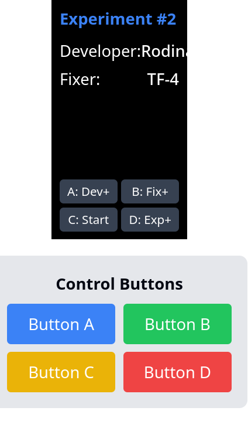
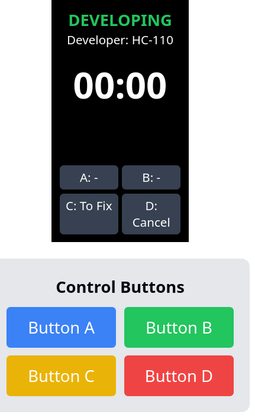

        
# Film Development Timer: Detailed Specification

## Overview

This document provides detailed specifications for a film development timer application designed for a Raspberry Pi Pico with a Pimoroni RGB display (240x135 pixels, portrait orientation) and 4 physical buttons. The application allows photographers to track and record development times for film strip tests using different chemical combinations.

## Hardware Requirements

- Raspberry Pi Pico or Pico W
- Pimoroni RGB Display Pack (240x135 pixels)
- 4 physical buttons (labeled A, B, C, D)
- Optional: Battery pack for portable use

## Software Requirements

- MicroPython with Pimoroni libraries
- PicoGraphics for display management
- File I/O capabilities for data logging

## Screen Specifications

### 1. Home Screen (Setup)

**Purpose**: Configure experiment settings before starting development process.

**Layout**:
- Top header: "Experiment #[number]" in blue (font size 14px)
- Middle section:
  - Row 1: "Developer:" with selected developer name on line below (prototype had on the right but too cramped)
  - Row 2: "Fixer:" with selected fixer name on line below (prototype had on the right but too cramped)
- Bottom section: Button labels
  - "A: Dev+" (cycles developer)
  - "B: Fix+" (cycles fixer)
  - "C: Start" (begins timer)
  - "D: Exp+" (increments experiment number)

**State Management**:
- Experiment number: Incremental integer (starts at 1)
- Developer selection: Index into developers array
- Fixer selection: Index into fixers array
- Button A increments developer index with wraparound
- Button B increments fixer index with wraparound
- Button C navigates to Development Timer screen
- Button D increments experiment number

**Design Notes**:
- Use high contrast for readability (white text on black background)
- Blue accent color for experiment number
- Full width layout for optimal use of narrow display

### 2. Development Timer Screen

**Purpose**: Track time while film is in developer solution.

**Layout**:
- Top section: "DEVELOPING" in green (font size 14px)
- Developer info: "Developer: [selected developer]" (font size 10px)
- Large timer display: "00:00" format (minutes:seconds, font size 24px)
- Bottom section: Button labels
  - "A: -" (inactive)
  - "B: -" (inactive)
  - "C: To Fix" (proceeds to fixing stage)
  - "D: Cancel" (aborts process, returns to home)

**State Management**:
- Timer starts automatically when screen is entered
- Timer increments every second
- Development time stored in memory
- Button C stops development timer, switches to Fix Timer screen
- Button D cancels process, resets timers, returns to Home screen

**Design Notes**:
- Green accent color indicates development process
- Large, centered timer for visibility at a distance
- Simple interface reduces chance of error during timing

### 3. Fix Timer Screen

**Purpose**: Track time while film is in fixer solution.

**Layout**:
- Top section: "FIXING" in blue (font size 14px)
- Fixer info: "Fixer: [selected fixer]" (font size 10px)
- Large timer display: "00:00" format (minutes:seconds, font size 24px)
- Bottom section: Button labels
  - "A: -" (inactive)
  - "B: -" (inactive)
  - "C: Done" (completes process)
  - "D: Cancel" (aborts process, returns to home)

**State Management**:
- Timer starts automatically when screen is entered
- Timer increments every second
- Fix time stored in memory
- Button C stops fixing timer, navigates to Results screen
- Button D cancels process, resets timers, returns to Home screen

**Design Notes**:
- Blue accent color indicates fixing process
- Same layout as Development screen for consistency
- Large, centered timer for visibility at a distance

### 4. Results Screen (Summary)

**Purpose**: Display results of completed test and save or discard data.

**Layout**:
- Top header: "COMPLETE" in green (font size 14px)
- Result summary:
  - Row 1: "Experiment #[number]"
  - Row 2: "Developer: [selected developer]"
  - Row 3: "Dev Time: [time in MM:SS format]"
  - Row 4: "Fix Time: [time in MM:SS format]"
- Bottom section: Button labels
  - "A: Home" (return to home without saving)
  - "B: -" (inactive)
  - "C: Save" (save result and return to home)
  - "D: Discard" (discard result and return to home)

**State Management**:
- Displays completed experiment data
- Button A returns to home screen without saving
- Button C saves result to memory and file, increments experiment number, returns to Home
- Button D discards result, returns to Home

**Design Notes**:
- Green "COMPLETE" indicates successful process
- Clean presentation of all relevant data
- Clear options for saving or discarding results

### 5. Logs Screen

**Purpose**: View history of saved development tests.

**Layout**:
- Top header: "Saved Logs" in blue (font size 14px)
- Scrollable content area:
  - Shows most recent 3 saved results
  - Each entry includes:
    - "#{id}: [developer]"
    - "Dev: [dev time] • Fix: [fix time]"
  - Message "No saved results" if none exist
- Bottom section: Button labels
  - "A: -" (inactive)
  - "B: Back" (return to home)
  - "C: -" (inactive)
  - "D: Clear" (delete all logs)

**State Management**:
- Displays most recent saved experiments from memory
- Limited to last 3 results due to screen size
- Button B returns to Home screen
- Button D clears all saved results (with confirmation prompt)

**Design Notes**:
- Compact display shows multiple entries
- Clear separation between entries
- Simple navigation as this is a view-only screen

### 6. Confirmation Dialog (Optional)

**Purpose**: Confirm potentially destructive actions.

**Layout**:
- Centered dialog box with message:
  - "Clear all logs?"
- Button labels:
  - "A: Yes"
  - "D: No"

**State Management**:
- Button A confirms action, proceeds with deletion
- Button D cancels, returns to previous screen

**Design Notes**:
- Modal overlay darkens background
- High contrast message for clarity
- Simple yes/no interface

## Navigation Flow

1. Application starts at Home Screen
2. From Home:
   - Start timer → Development Timer
   - View logs → Logs Screen
3. From Development Timer:
   - Proceed → Fix Timer
   - Cancel → Home Screen
4. From Fix Timer:
   - Complete → Results Screen
   - Cancel → Home Screen
5. From Results:
   - Save → Home Screen (increment experiment)
   - Discard → Home Screen (maintain experiment)
6. From Logs:
   - Back → Home Screen
   - Clear → Confirmation Dialog → Logs/Home Screen

## Data Management

### Local Storage

Results are saved in two locations:
1. In-memory array during runtime
2. Text file in CSV format for persistence

### CSV Format
```
experiment_id,developer,fixer,develop_time_sec,fix_time_sec,timestamp
```

Example:
```
1,D-76,Rapid Fix,120,300,1709875462
2,Rodinal,Ilford,180,240,1709875980
```

### Preset Data

Developer options (customizable):
- D-76
- Rodinal
- HC-110
- XTOL
- Pyro

Fixer options (customizable):
- Rapid Fix
- TF-4
- Ilford
- Kodak

## Technical Implementation Notes

1. **Display Management**:
   - Use PicoGraphics library for all screen rendering
   - Clear screen before drawing new content
   - Update display at appropriate intervals (timer: 1 second)
   - Use consistent font sizes and colors across screens

2. **Button Handling**:
   - Implement debounce for physical buttons (200ms)
   - Enable long-press for certain actions (optional)
   - Update button labels based on context
   - Handle button combinations for advanced functions (optional)

3. **Timer Implementation**:
   - Use hardware timer for accurate timing
   - Format as MM:SS for display
   - Store time in seconds internally

4. **File Handling**:
   - Append new entries to file
   - Handle file I/O errors gracefully
   - Keep in-memory backup of recent results

5. **Power Management**:
   - Implement sleep mode during inactivity (optional)
   - Display battery level if powered by battery (optional)
   - Safe shutdown procedure to prevent data loss

## Future Enhancements

1. Temperature logging for developer and fixer
2. Custom notes field for each experiment
3. Data export via USB or wireless (Pico W)
4. Graph visualization of development times across experiments
5. Multiple user profiles for different photographers
6. Customizable time presets based on film type

## Conclusion

This film development timer provides a complete solution for photographers to accurately track and record film development processes. The multi-screen interface optimizes the limited display space while maintaining intuitive navigation through the four-button control system.

---
 
main screen


timer screen 
