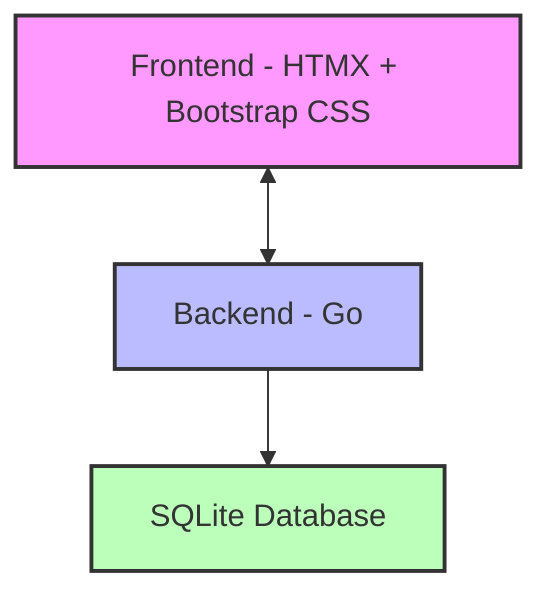
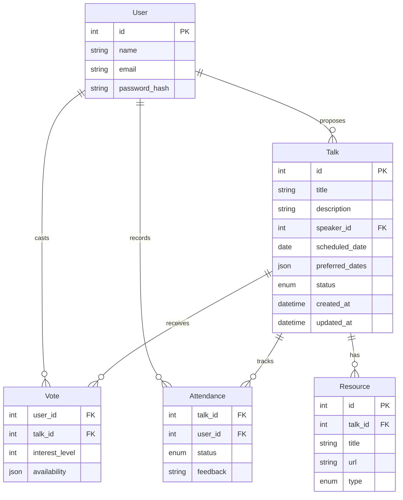

# How to Build a Friday Talks Scheduling Web Application

## 1. Introduction
- **Purpose:** Create a user-friendly web application that allows you and your friends to schedule, manage, and track talks for your Friday gatherings
- **Audience:** Small to medium-sized groups of friends who want to organize regular knowledge-sharing sessions
- **Value:** Simplifies coordination, reduces administrative overhead, and helps maintain consistency in your Friday talk series

## 2. Requirements and Specifications

### Core Requirements
- Allow users to propose talks with title, description, and preferred dates
- Display a calendar view of scheduled and upcoming talks
- Enable talk voting/interest indication
- Send reminders to scheduled speakers and attendees
- Track talk history and attendance

### Nice-to-Have Features
- Speaker profiles with talk history
- Rating/feedback system for completed talks
- Topic tagging and categorization
- Resource sharing (slides, links, etc.)
- Integration with video conferencing tools

### Technical Constraints
- Browser-based application accessible on desktop and mobile
- Minimal external dependencies for easier maintenance
- Secure but simple authentication system

## 3. Architecture Overview



### Technology Choices
- **Go backend:** Lightweight, fast, and easy to deploy with built-in concurrency
- **HTMX + Bootstrap:** Simple yet powerful frontend approach without complex JS frameworks
- **SQLite:** File-based database that requires minimal setup and maintenance
- **Templ:** Go HTML templating for server-side rendering
- **Cobra:** Command-line interface for server management

## 4. Data Model



### User
- `id`: Unique identifier
- `name`: Display name
- `email`: Contact email (for notifications)
- `password_hash`: Securely stored password

### Talk
- `id`: Unique identifier
- `title`: Talk title
- `description`: Talk description
- `speaker_id`: Reference to User
- `scheduled_date`: Date when talk is scheduled (nullable)
- `preferred_dates`: JSON array of preferred dates
- `status`: Enum (proposed, scheduled, completed, canceled)
- `created_at`: Timestamp
- `updated_at`: Timestamp

### Vote
- `user_id`: Reference to User
- `talk_id`: Reference to Talk
- `interest_level`: Integer (1-5)
- `availability`: JSON object mapping dates to availability

### Attendance
- `talk_id`: Reference to Talk
- `user_id`: Reference to User
- `status`: Enum (confirmed, attended, declined, no-show)
- `feedback`: Optional feedback text

### Resource
- `id`: Unique identifier
- `talk_id`: Reference to Talk
- `title`: Resource title
- `url`: Link to resource
- `type`: Enum (slides, video, code, article, other)

## 5. Implementation Plan

### Phase 1: Core Setup
1. Initialize Go project with modules
2. Set up database schema and migrations
3. Create basic user authentication
4. Implement talk proposal and listing

### Phase 2: Scheduling Features
1. Add calendar view
2. Implement voting system
3. Create scheduling algorithm based on votes
4. Set up email notifications

### Phase 3: History and Resources
1. Add talk history tracking
2. Implement resource sharing
3. Create attendance tracking
4. Add feedback system

### Directory Structure
```
/friday-talks
  /cmd
    /server        # Main application entry point
  /internal
    /auth          # Authentication logic
    /handlers      # HTTP request handlers
    /models        # Data models and database access
    /templates     # Templ HTML templates
    /services      # Business logic
  /migrations      # Database migrations
  /static          # CSS, JS, images
  /docs            # Documentation
  go.mod           # Go module definition
  README.md        # Project documentation
```

## 6. Key Features Implementation

### Talk Proposal System

```go
// internal/handlers/talks.go
func (h *Handler) ProposeTalk(w http.ResponseWriter, r *http.Request) {
    // Parse form
    if err := r.ParseForm(); err != nil {
        h.renderError(w, err, http.StatusBadRequest)
        return
    }
    
    // Get current user from context
    user := auth.UserFromContext(r.Context())
    if user == nil {
        http.Redirect(w, r, "/login", http.StatusSeeOther)
        return
    }
    
    // Create talk from form data
    talk := &models.Talk{
        Title:          r.FormValue("title"),
        Description:    r.FormValue("description"),
        SpeakerID:      user.ID,
        PreferredDates: parsePreferredDates(r.Form["preferred_dates"]),
        Status:         models.TalkStatusProposed,
        CreatedAt:      time.Now(),
        UpdatedAt:      time.Now(),
    }
    
    // Save to database
    if err := h.talkService.Create(r.Context(), talk); err != nil {
        h.renderError(w, err, http.StatusInternalServerError)
        return
    }
    
    // Redirect to talk page
    http.Redirect(w, r, fmt.Sprintf("/talks/%d", talk.ID), http.StatusSeeOther)
}
```

### Scheduling Algorithm

```go
// internal/services/scheduler.go
func (s *SchedulerService) SuggestNextFriday(ctx context.Context) (time.Time, []*models.Talk, error) {
    // Find next Friday that hasn't been scheduled yet
    nextFriday := findNextFriday(time.Now())
    for isDateScheduled(ctx, s.db, nextFriday) {
        nextFriday = nextFriday.AddDate(0, 0, 7)
    }
    
    // Get proposed talks with preferred dates matching nextFriday
    talks, err := s.talkRepo.FindProposedWithPreferredDate(ctx, nextFriday)
    if err != nil {
        return time.Time{}, nil, err
    }
    
    // Sort talks by votes and speaker history (prioritize new speakers)
    sortedTalks, err := s.rankTalksByPreference(ctx, talks)
    if err != nil {
        return time.Time{}, nil, err
    }
    
    return nextFriday, sortedTalks, nil
}
```

### Notification System

```go
// internal/services/notifications.go
func (n *NotificationService) SendTalkConfirmation(ctx context.Context, talk *models.Talk) error {
    // Get speaker information
    speaker, err := n.userRepo.FindByID(ctx, talk.SpeakerID)
    if err != nil {
        return fmt.Errorf("failed to find speaker: %w", err)
    }
    
    // Format email content
    subject := fmt.Sprintf("Your talk '%s' is confirmed for %s", 
        talk.Title, 
        talk.ScheduledDate.Format("Monday, January 2, 2006"))
    
    body := fmt.Sprintf(`
        Hello %s,
        
        Your talk "%s" has been scheduled for %s.
        
        Please prepare your materials and let us know if you need any special accommodations.
        
        Friday Talks Team
    `, speaker.Name, talk.Title, talk.ScheduledDate.Format("Monday, January 2, 2006"))
    
    // Send email
    return n.emailService.Send(ctx, speaker.Email, subject, body)
}
```

## 7. UI/UX Considerations

### Main Interface Elements
1. **Dashboard:** Overview of upcoming talks, your proposed talks, and voting opportunities
2. **Calendar View:** Visual representation of scheduled talks by month
3. **Talk Detail Page:** Comprehensive information about a specific talk
4. **Proposal Form:** User-friendly interface for suggesting new talks

### User Flows

```mermaid
graph TD
    A[Dashboard] --> B[Propose Talk]
    B --> C[Submit Talk]
    C --> D[Notifications]
    
    A --> E[View Proposed Talks]
    E --> F[Vote on Talks]
    F --> G[System Schedules]
    G --> D
    
    A --> H[View Scheduled Talk]
    H --> I[Confirm Attendance]
    H --> J[Access Resources]
    H --> K[Provide Feedback]
    
    classDef start fill:#f9f9f9,stroke:#333,stroke-width:2px;
    classDef process fill:#e1f5fe,stroke:#333,stroke-width:1px;
    classDef end fill:#e8f5e9,stroke:#333,stroke-width:1px;
    
    class A start;
    class B,E,H process;
    class D,G,I,J,K end;
```

1. **Proposing a Talk:**
   - Click "Propose Talk" button on dashboard
   - Fill out title, description, and select potential dates
   - Submit and receive confirmation
   
2. **Voting on Talks:**
   - Browse proposed talks on dashboard
   - Indicate interest level and availability for each talk
   - System aggregates votes to determine scheduling

3. **Attending a Talk:**
   - Receive notification of upcoming talk
   - Confirm attendance
   - Access resources before/after the talk
   - Provide feedback after attending

### Key Screens
1. **Dashboard Page:** Central hub showing upcoming talks, history, and notifications
2. **Talk Proposal Form:** Clean, step-by-step interface for suggesting talks
3. **Talk Detail View:** Comprehensive information about a single talk
4. **User Profile:** Shows talk history and preferences
