# Technical Documentation: Downloads Folder Analysis Script

## 1. Introduction

This document provides a detailed technical breakdown of the `cmd/apps/desktop-organizer/01-inspect-downloads-folder.sh` script. The script analyzes the contents of a user's Downloads folder, providing insights into file types, sizes, duplicates, modification dates, and more. It utilizes several external tools for accurate analysis and employs optimization techniques like sampling to handle potentially large directories.

The primary goal of this document is to capture the script's logic and implementation details to guide a future reimplementation in Go, enabling better structure, error handling, concurrency, and maintainability.

## 2. Core Functionality

The script performs the following main tasks:

1.  **Checks Prerequisites:** Verifies Bash version and detects the availability of key external tools (`magika`, `exiftool`, `jdupes`).
2.  **Parses Arguments:** Handles command-line flags for verbose output (`-v`, `--verbose`) and directory sampling (`-s N`, `--sample-per-dir N`).
3.  **Collects Basic Stats:** Gathers top-level statistics (item/file/directory counts, total size) for the Downloads directory.
4.  **Lists Files Recursively:** Finds all regular files within the Downloads directory, excluding specific paths (e.g., `__MACOSX`).
5.  **Pre-computes Metadata:** Iterates through the file list once to cache essential metadata (size, modification time) in Bash associative arrays.
6.  **Analyzes File Types:** Uses `magika` (if available) or the `file` command to determine the type and group for each file. Implements a sampling strategy to limit analysis on large directories if requested.
7.  **Aggregates Type Information:** Calculates counts and total sizes for each identified file type.
8.  **Analyzes Media Files:** Identifies media files based on the `magika` group and uses `exiftool` to extract metadata for the top 10 largest media files.
9.  **Detects Duplicates:** Uses `jdupes` (if available) or MD5 hashing to find duplicate files.
10. **Identifies Recent & Large Files:** Lists files modified within the last 30 days and files larger than 100MB, using the pre-computed metadata.
11. **Analyzes File Timeline:** Groups files by modification month/year to provide a historical perspective.
12. **Generates Report:** Compiles all analysis results into a formatted text file (`downloads_analysis.txt`).
13. **Provides Recommendations:** Offers basic suggestions for organization based on the analysis.

## 3. Command-Line Arguments

The script accepts the following optional arguments, parsed using `getopt`:

*   `-v`, `--verbose`: Enables verbose logging to standard error. Includes detailed step-by-step information useful for debugging.
*   `-s N`, `--sample-per-dir N`: Enables directory sampling for the file type analysis phase (specifically for `magika`). Only the first `N` files encountered within each subdirectory will be passed to `magika`. If `N` is 0 or the flag is omitted, all files are analyzed.

## 4. Key Components & Phases

### 4.1. Initialization & Tool Detection

*   **Bash Version Check:** Ensures Bash version is 4.0+ due to the use of associative arrays.
    ```bash
    if (( BASH_VERSINFO[0] < 4 )); then ...
    ```
*   **Variable Setup:** Defines `DOWNLOADS_DIR`, output filenames, and initializes flags (`VERBOSE`, `SAMPLE_PER_DIR`).
*   **Logging Setup:** Configures file descriptor 3 for the debug log (`exec 3>"$DEBUG_LOG"`) and defines logging functions (`debug`, `vdebug`, `show_status`).
*   **Argument Parsing:** Uses `getopt` to handle `-v` and `-s` flags.
*   **Tool Detection:** Uses `command -v` to check for `magika`, `exiftool`, and `jdupes`, storing availability in flags (`MAGIKA_AVAILABLE`, etc.) and printing warnings if tools are missing.

### 4.2. Basic Stats (Top-Level)

*   Uses `find` with `-maxdepth 1` and `-mindepth 1` to count immediate children (files and directories) of `$DOWNLOADS_DIR`.
    ```bash
    TOTAL_ITEMS_TOP=$(find "$DOWNLOADS_DIR" -maxdepth 1 -mindepth 1 -printf '.' | wc -c)
    TOTAL_FILES_TOP=$(find "$DOWNLOADS_DIR" -maxdepth 1 -type f -printf '.' | wc -c)
    TOTAL_DIRS_TOP=$(find "$DOWNLOADS_DIR" -maxdepth 1 -type d -mindepth 1 -printf '.' | wc -c)
    ```
*   Uses `du -sh` for the total recursive size.
*   Results are written to `$OUTPUT_FILE`.

### 4.3. Recursive File Listing

*   Uses `find` to locate all regular files (`-type f`) recursively.
*   Excludes specific directories using `-path '*/<dir_name>/*' -prune -o`.
    ```bash
    find "$DOWNLOADS_DIR" -path '*/__MACOSX/*' -prune -o -type f -print0 > "$TEMP_ALL_FILES_LIST"
    ```
*   `-print0` outputs filenames separated by null characters, safely handling filenames with spaces, newlines, or other special characters.
*   The list is stored in a temporary file (`$TEMP_ALL_FILES_LIST`).
*   The total count is stored in `$TOTAL_FILES_RECURSIVE` using `grep -zc $'\0'`.

### 4.4. File Metadata Pre-computation

*   **Purpose:** Avoids repeatedly running `stat` or `du` for each file in later analysis phases.
*   **Data Structures:** Uses Bash 4+ associative arrays:
    *   `file_paths`: Stores paths (used as keys).
    *   `file_sizes`: `path -> size_in_bytes`
    *   `file_types`: `path -> type_label (string)`
    *   `file_groups`: `path -> type_group (string)`
    *   `file_mod_times`: `path -> YYYY-MM-DD HH:MM:SS`
    *   `file_mod_epochs`: `path -> epoch_seconds`
*   **Process:** Reads the null-terminated list from `$TEMP_ALL_FILES_LIST`.
    ```bash
    while IFS= read -r -d $'\0' filepath; do
        # ... update status/vdebug ...
        file_sizes["$filepath"]=$(get_file_size "$filepath") # Uses du -b
        mod_epoch=$(stat -c '%Y' "$filepath" 2>/dev/null || echo "0")
        file_mod_epochs["$filepath"]=$mod_epoch
        file_mod_times["$filepath"]=$(date -d "@$mod_epoch" '+%Y-%m-%d %H:%M:%S' 2>/dev/null || echo "Unknown")
    done < "$TEMP_ALL_FILES_LIST"
    ```

### 4.5. File Type Analysis (Magika/`file`, Sampling Logic)

*   **Goal:** Determine the type (`ct_label`) and group (`group`) for each file, storing them in `file_types` and `file_groups` arrays.
*   **Tool Preference:** Uses `magika` if available for better accuracy, otherwise falls back to `file -b`.

*   **Magika Path (`MAGIKA_AVAILABLE=1`):**
    1.  **Sampling (if `SAMPLE_PER_DIR > 0`):**
        *   A temporary file (`$TEMP_SAMPLED_FOR_MAGIKA`) is created.
        *   An `awk` script reads the null-terminated full file list (`$TEMP_ALL_FILES_LIST`), counts files per directory, and writes a null-terminated list of sampled file paths (up to `SAMPLE_PER_DIR`) to `$TEMP_SAMPLED_FOR_MAGIKA`.
            ```awk
            # awk script within the shell script:
            awk -v limit="$SAMPLE_PER_DIR" 'BEGIN{FS=OFS=RS="\0"; ORS="\0"} {
                dir = $0; sub(/\/[^\/]*$/, "", dir); # Get dirname
                if (count[dir] < limit) {
                    print $0;
                    count[dir]++;
                }
            }' "$TEMP_ALL_FILES_LIST" > "$TEMP_SAMPLED_FOR_MAGIKA"
            ```
        *   The list to be processed by `magika` becomes `$TEMP_SAMPLED_FOR_MAGIKA`.
        *   The file count for status updates (`$TOTAL_FILES_FOR_MAGIKA`) is updated.
    2.  **Magika Execution:**
        *   Uses `xargs -0 -I {} magika --json {} < "$MAGIKA_INPUT_LIST"`.
        *   `xargs -0` reads the null-terminated list from `$MAGIKA_INPUT_LIST` (which is either the full list or the sampled list).
        *   `magika --json {}` is executed for each file path `{}`.
        *   The output (one JSON object per file, per line) is redirected to `$TEMP_MAGIKA_OUTPUT`.
    3.  **JSON Processing:**
        *   Reads `$TEMP_MAGIKA_OUTPUT` line by line.
        *   For each line (JSON object), uses `jq` (if available) or basic string parsing (`cut`, `grep`) to extract `path`, `result.value.output.ct_label` (as `type`), and `result.value.output.group` (as `group`).
        *   Stores extracted `type` and `group` in the `file_types` and `file_groups` associative arrays, keyed by `path`.

*   **`file` Path (`MAGIKA_AVAILABLE=0`):**
    *   Loops through the full file list (`$TEMP_ALL_FILES_LIST`).
    *   Runs `file -b "$filepath"` for each file.
    *   Stores the output in `file_types["$filepath"]`. (Note: `file_groups` array is not populated in this case).

*   **Type Aggregation:**
    *   Iterates through the `file_types` array.
    *   Uses two more associative arrays (`type_counts`, `type_sizes`) to aggregate counts and total sizes per file type label.
    *   Prints the aggregated results, sorted by count, to the report file.
    *   If sampling was used, adds a note to the report header.

### 4.6. Media File Analysis

*   **Condition:** Only runs if `EXIFTOOL_AVAILABLE=1`.
*   **File Selection:**
    *   Iterates through the pre-computed `file_groups` array (populated only if Magika was used).
    *   Selects files where `group` is `image`, `video`, or `audio`.
    *   Stores these candidate media file paths and their sizes in a temporary associative array `media_files`.
    *   Sorts `media_files` by size descending (`sort -nr -k1`), takes the top 10 (`head -n 10`), and extracts the paths (`cut -f2`).
*   **Metadata Extraction:**
    *   Loops through the top 10 largest media file paths.
    *   Uses `exiftool -s3 -Tag1 -Tag2 ... "$filepath"` to extract specific tags (`FileType`, `ImageSize`, `Duration`, `CreateDate`, `MediaCreateDate`). `|| echo "N/A"` or similar provides fallbacks.
    *   Formats and prints the filename, Magika type (`file_types[$filepath]`), resolution/duration, and creation date to the report.

### 4.7. Duplicate File Analysis

*   **Tool Preference:** Uses `jdupes` if available, otherwise falls back to MD5 hashing.

*   **jdupes Path (`JDUPES_AVAILABLE=1`):**
    *   Runs `jdupes -r -q -o name "$DOWNLOADS_DIR"` to get a list of duplicate sets, redirecting output to a temporary file (`$TEMP_JDUPES_RAW`).
    *   Runs `jdupes -r -q -S "$DOWNLOADS_DIR"` to get summary information (counts, wasted space), redirecting output to `$TEMP_JDUPES_SUMMARY`.
    *   Parses `$TEMP_JDUPES_SUMMARY` using `grep` and `awk` to extract set count, duplicate file count, and wasted space.
    *   Prints summary to the report file.
    *   Prints the first 5 duplicate sets from `$TEMP_JDUPES_RAW` using `awk 'BEGIN{RS=""; ORS="\n\n"; set_count=0} {if (NF > 1 && set_count < 5) {print $0; set_count++}}'`.

*   **MD5 Path (`JDUPES_AVAILABLE=0`):**
    *   Loops through the full file list (`$TEMP_ALL_FILES_LIST`).
    *   Calculates `md5sum -b "$filepath"` for each file, storing hash and path in `$TEMP_MD5_HASHLIST`.
    *   Finds duplicate hashes: `cut -d ' ' -f 1 "$TEMP_MD5_HASHLIST" | sort | uniq -d > "$TEMP_MD5_DUPLICATES"`.
    *   If duplicates exist, iterates through the first 5 duplicate hashes.
    *   For each duplicate hash, `grep`s `$TEMP_MD5_HASHLIST` to find corresponding filenames and prints them.

### 4.8. Recent/Large File Reporting

*   Uses the pre-computed metadata (`file_mod_epochs`, `file_sizes`, `file_types`, `file_mod_times`).
*   **Recent Files:**
    *   Calculates the epoch time for 30 days ago.
    *   Iterates through `file_mod_epochs`. If `mod_epoch > thirty_days_ago_epoch`, retrieves corresponding type, size, and date string.
    *   Stores results (prefixed with epoch for sorting) in a temporary file.
    *   Sorts the temporary file numerically descending by epoch (`sort -t'|' -k1 -nr`) and prints formatted output.
*   **Large Files:**
    *   Defines `LARGE_FILE_THRESHOLD` (100MB).
    *   Iterates through `file_sizes`. If `size_bytes > LARGE_FILE_THRESHOLD`, retrieves corresponding type and path.
    *   Stores results (prefixed with size for sorting) in a temporary file.
    *   Sorts the temporary file numerically descending by size (`sort -t'|' -k1 -nr`) and prints formatted output.

### 4.9. Files by Year/Month Reporting

*   Uses pre-computed `file_mod_times` and `file_sizes`.
*   Aggregates counts (`month_counts`) and total sizes (`month_sizes`) into associative arrays keyed by `YYYY-MM` (extracted from `file_mod_times`).
*   Prints aggregated data to a temporary file.
*   Sorts the temporary file chronologically by key (`sort -t'|' -k1`) and prints formatted output.

### 4.10. Recommendations

*   Prints static text providing general suggestions based on the report sections (review types, large files, duplicates, etc.).
*   Includes example `jdupes` commands if it was available and duplicates were found.

## 5. Data Structures

The script relies heavily on **Bash 4+ Associative Arrays** to cache file metadata and aggregated results, avoiding redundant computations and file reads.

*   `file_paths`: `map[string]int` (Used like a set)
*   `file_sizes`: `map[string]int64`
*   `file_types`: `map[string]string` (Stores Magika label or `file` output)
*   `file_groups`: `map[string]string` (Stores Magika group)
*   `file_mod_times`: `map[string]string` (Formatted time string)
*   `file_mod_epochs`: `map[string]int64` (Epoch seconds)
*   `type_counts`: `map[string]int` (Counts per type label)
*   `type_sizes`: `map[string]int64` (Total size per type label)
*   `month_counts`: `map[string]int` (Counts per YYYY-MM)
*   `month_sizes`: `map[string]int64` (Total size per YYYY-MM)
*   `media_files`: `map[string]int64` (Temporary map for media file selection)

## 6. Orchestration Tools and Go Equivalents

These tools are primarily used in the shell script for flow control, text processing, and basic file system operations. A Go reimplementation would typically replace these with standard library functions or idiomatic Go patterns.

*   **`find`**: Used for recursive file listing with specific criteria (type, path exclusion).
    *   **Shell Usage:** `find "$DOWNLOADS_DIR" -path '*/__MACOSX/*' -prune -o -type f -print0`
    *   **Go Equivalent:** `filepath.WalkDir`. This function efficiently traverses directory trees. Filtering logic (like path exclusion and file type) would be implemented within the `WalkDirFunc` provided to `WalkDir`.

*   **`awk`**: Used for the sampling logic (counting files per directory) and parsing `jdupes` summary output.
    *   **Shell Usage (Sampling):** `awk -v limit="..." 'BEGIN{...} {...}' "$TEMP_ALL_FILES_LIST" > "$TEMP_SAMPLED_FOR_MAGIKA"`
    *   **Shell Usage (jdupes parse):** `grep "..." | awk '{print $1}'`
    *   **Go Equivalent:** Custom Go code. The sampling logic would involve maintaining a map (`map[string]int`) to track counts per directory during the file traversal (`filepath.WalkDir`). Parsing specific lines from tool output would use string manipulation functions (`strings` package) or regular expressions (`regexp` package) if needed.

*   **`jq`**: (Optional) Used for parsing JSON output from `magika` if available.
    *   **Shell Usage:** `echo "$line" | jq -r '.path'`
    *   **Go Equivalent:** `encoding/json` package. Unmarshal the JSON string into a Go struct or `map[string]interface{}`.

*   **`xargs`**: Used to execute `magika` for each file in the input list.
    *   **Shell Usage:** `xargs -0 -I {} magika --json {} < "$MAGIKA_INPUT_LIST"`
    *   **Go Equivalent:** Goroutines and potentially a worker pool pattern. Launch a goroutine for each file (or use a limited pool) that executes the `magika` command via `os/exec`.

*   **`sort`**: Used to sort file lists (by size, modification time) and aggregated stats (by count, chronologically).
    *   **Shell Usage:** `sort -t'|' -k1 -nr "$TEMP_FILE"`
    *   **Go Equivalent:** `sort` package (`sort.Slice`, `sort.SliceStable`). Define custom comparison functions based on the desired sorting criteria (size, time, count) for slices of structs or maps.

*   **`grep`**: Used for counting null-terminated files (`-zc`), filtering lines (`grep "..."`), finding duplicate hashes (`-F`, `uniq -d` is also used).
    *   **Shell Usage:** `grep -zc $'\0' "$FILE"`, `grep "pattern" file`
    *   **Go Equivalent:** String searching (`strings.Contains`, `strings.HasPrefix`), regular expressions (`regexp` package), or custom logic within loops. Counting items would be done with slice lengths or map sizes.

*   `cut`, `sed`, `head`, `wc`: General text/line manipulation.
    *   **Shell Usage:** Various (e.g., `cut -d' ' -f1`, `sed 's/...//'`, `head -n 5`, `wc -l`)
    *   **Go Equivalent:** String manipulation (`strings` package), slice operations, basic counting logic.

*   `mktemp`: Creates temporary files.
    *   **Shell Usage:** `VAR=$(mktemp)`
    *   **Go Equivalent:** `os.CreateTemp`. Used if temporary files are still strictly necessary (less common in Go unless interacting heavily with external tools requiring file lists).

*   `getopt`: Parses command-line arguments.
    *   **Shell Usage:** `TEMP=$(getopt -o vs: ...)`
    *   **Go Equivalent:** `flag` package. Define flags using `flag.StringVar`, `flag.IntVar`, `flag.BoolVar`, etc., and parse using `flag.Parse()`.

## 7. External Analysis Tool Integration Details

These tools perform specialized analysis that might be complex or impractical to reimplement directly in Go. They are treated as external dependencies executed via `os/exec`.

*   **`magika`** (Google - File Type Detection)
    *   **Reason for External Call:** Leverages a pre-trained AI model; reimplementing is infeasible.
    *   **Flags Used:** `--json` (requests JSON output), `{}` (placeholder for filename when used with `xargs`).
    *   **Invocation:** `xargs -0 -I {} magika --json {} < "$INPUT_LIST_FILE" > "$OUTPUT_FILE"`
    *   **Output Processing:** Reads the output file line by line. Each line contains a JSON object representing one file's analysis. Parses this JSON (using `jq` or Go's `encoding/json`) to extract `path`, `result.value.output.ct_label` (type), and `result.value.output.group`.

*   **`exiftool`** (Phil Harvey - Metadata Extraction)
    *   **Reason for External Call:** Extremely comprehensive metadata support across many file types; Go libraries often cover less.
    *   **Flags Used:** `-s3` (prints tag values only, no labels), `-FileType`, `-ImageSize`, `-Duration`, `-CreateDate`, `-MediaCreateDate`, `-MIMEType` (specific tags requested).
    *   **Invocation:** `exiftool -s3 -Tag1 -Tag2 ... "$filepath"`
    *   **Output Processing:** Reads the standard output. Each requested tag value appears on a new line. The script parses these lines sequentially, handling cases where tags might be missing.

*   **`jdupes`** (Jody Bruchon - Duplicate File Finder)
    *   **Reason for External Call:** Highly optimized C implementation for speed.
    *   **Flags Used:**
        *   `-r`: Recursive search.
        *   `-q`: Quiet mode (suppresses progress indicators).
        *   `-o name`: Orders files within duplicate sets by name.
        *   `-S`: Prints summary information (counts, sizes).
    *   **Invocation (Listing):** `jdupes -r -q -o name "$DOWNLOADS_DIR" > "$TEMP_JDUPES_RAW"`
    *   **Invocation (Summary):** `jdupes -r -q -S "$DOWNLOADS_DIR" > "$TEMP_JDUPES_SUMMARY"`
    *   **Output Processing:**
        *   **List:** Parses the raw output where sets are separated by blank lines. Uses `awk` to extract the first few sets.
        *   **Summary:** Parses specific lines containing keywords like "sets of duplicate files" and "would be freed" using `grep` and `awk` to get counts and total wasted size.

*   **`file`** (System Utility - Basic File Type Detection)
    *   **Reason for External Call:** Used only as a fallback if `magika` is unavailable. Standard, widely available utility.
    *   **Flags Used:** `-b` (brief output, no filename).
    *   **Invocation:** `file -b "$filepath"`
    *   **Output Processing:** Takes the raw string output as the file type label.

*   **`md5sum`** (System Utility - MD5 Hashing)
    *   **Reason for External Call:** Used only as a fallback if `jdupes` is unavailable. A Go implementation is preferred (see section 11).
    *   **Flags Used:** `-b` (binary mode, treats file as binary).
    *   **Invocation:** `md5sum -b "$filepath" >> "$TEMP_MD5_HASHLIST"`
    *   **Output Processing:** The output (`hash *filename`) is collected. Hashes are extracted (`cut`), sorted (`sort`), and duplicates identified (`uniq -d`). Then, the original list is `grep`ped for the duplicate hashes to find the corresponding filenames.

## 8. Optimization Strategies

*   **Metadata Pre-computation:** Reading file size and modification time once and storing in associative arrays significantly speeds up subsequent phases (Recent, Large, By Month) compared to re-running `stat`/`du` for each file multiple times.
*   **Null-Terminated Paths:** Using `find ... -print0`, `xargs -0`, and reading with `read -r -d $'\0'` ensures robust handling of all possible filenames.
*   **Directory Sampling (`--sample-per-dir`):** Allows skipping potentially slow `magika` analysis on thousands of files within the same directory, providing a performance trade-off.
*   **Tool Prioritization:** Uses faster/better tools (`magika`, `jdupes`) when available, with functional fallbacks.

## 9. Logging

*   **Debug Log (`DEBUG_LOG` file):** Captures detailed step execution via `debug()` function, written to FD 3.
*   **Standard Error:**
    *   `debug()` output is mirrored here.
    *   `vdebug()` output appears here only if `VERBOSE=1`.
    *   `show_status()` messages appear here (overwriting the line unless `VERBOSE=1`).
    *   Tool availability warnings.
    *   Final summary and tool status.
*   **Standard Output:** Only used for redirecting results into the `$OUTPUT_FILE`.

## 10. Output Format

*   **Report File (`downloads_analysis.txt`):** Plain text file with distinct sections for each analysis type. Uses `printf` for basic column alignment.
*   **Debug Log (`downloads_analysis_debug.log`):** Timestamped debug messages.

## 11. Mermaid Diagram (Process Flow)

```mermaid
flowchart TD
    Start --> CheckBashVer{Bash >= 4.0?}
    CheckBashVer -- Yes --> ParseArgs[Parse Args -v, -s]
    CheckBashVer -- No --> ErrorExit{Exit: Bash Too Old}
    ParseArgs --> ToolDetection{Detect Tools magika, exiftool, jdupes}
    ToolDetection --> BasicStats[Collect Basic Top-Level Stats]
    BasicStats --> FindFiles[Find Files Recursively Exclude __MACOSX]
    FindFiles --> PrecomputeMeta[Precompute Size/ModTime Cache in Arrays]
    
    PrecomputeMeta --> CheckMagika{Magika Available?}
    CheckMagika -- Yes --> SampleFiles{Sampling Enabled -s N?}
    CheckMagika -- No --> FileTypeFile[Analyze Types using file]
    
    SampleFiles -- Yes --> ApplySampling[Apply Sampling awk]
    SampleFiles -- No --> MagikaInputFull[Use Full List]
    ApplySampling --> MagikaInputSampled[Use Sampled List]
    
    MagikaInputFull --> MagikaAnalyze[Analyze Types using Magika xargs]
    MagikaInputSampled --> MagikaAnalyze
    FileTypeFile --> AggregateTypes[Aggregate Type Stats]
    MagikaAnalyze --> ProcessMagikaJSON[Process Magika JSON jq/grep]
    ProcessMagikaJSON --> AggregateTypes
    
    AggregateTypes --> CheckExifTool{ExifTool Available?}
    CheckExifTool -- Yes --> SelectMedia[Select Top 10 Media Files by Size/Group]
    CheckExifTool -- No --> Dupes
    SelectMedia --> AnalyzeMedia[Analyze Media Metadata exiftool]
    AnalyzeMedia --> Dupes
    
    Dupes --> CheckJdupes{jdupes Available?}
    CheckJdupes -- Yes --> AnalyzeDupesJdupes[Analyze Duplicates jdupes]
    CheckJdupes -- No --> AnalyzeDupesMD5[Analyze Duplicates md5sum]
    AnalyzeDupesJdupes --> RecentLarge
    AnalyzeDupesMD5 --> RecentLarge
    
    RecentLarge --> AnalyzeRecent[Report Recent Files from Cache]
    AnalyzeRecent --> AnalyzeLarge[Report Large Files from Cache]
    AnalyzeLarge --> AnalyzeByMonth[Report Files by Month from Cache]
    AnalyzeByMonth --> GenerateReport[Generate Text Report]
    GenerateReport --> AddRecommendations[Add Recommendations]
    AddRecommendations --> PrintSummary[Print Final Summary to Stderr]
    PrintSummary --> End

    subgraph FileTypeAnalysis [File Type Analysis]
        CheckMagika
        SampleFiles
        ApplySampling
        MagikaInputFull
        MagikaInputSampled
        FileTypeFile
        MagikaAnalyze
        ProcessMagikaJSON
        AggregateTypes
    end

    subgraph DuplicateAnalysis [Duplicate Analysis]
        CheckJdupes
        AnalyzeDupesJdupes
        AnalyzeDupesMD5
    end
```



## 12. Considerations for Go Reimplementation

*   **Concurrency:**
    *   File listing, metadata collection, and type analysis are highly parallelizable.
    *   Use goroutines managed by `sync.WaitGroup` or `errgroup.Group`.
    *   Consider a worker pool pattern for processing files (stat, type analysis).
    *   Use channels for passing file paths between stages.
    *   Be mindful of resource limits (file descriptors, CPU, memory) when setting concurrency levels.
*   **Data Structures:**
    *   Replace Bash associative arrays with Go maps (`map[string]FileInfo`, `map[string]int64`, etc.).
    *   Define structs (e.g., `FileInfo`, `TypeStats`, `DuplicateSet`) for better organization.
*   **File System Interaction:**
    *   Use `filepath.WalkDir` for efficient recursive traversal.
    *   Use `os.Stat` or `os.Lstat` for file metadata.
*   **External Tools vs. Go Libraries:**
    *   **Magika:** Requires running the external `magika` binary (`os/exec`). Parsing JSON output is straightforward (`encoding/json`). Consider potential performance overhead of many `exec` calls vs. the `xargs` approach in Bash.
    *   **ExifTool:** Requires running `exiftool` (`os/exec`). Parsing its output can be complex; consider targeted tags and robust parsing or searching for Go EXIF libraries (though `exiftool` is often more comprehensive).
    *   **jdupes/MD5:** Duplicate detection can be implemented purely in Go. Calculate hashes (MD5, SHA256) concurrently, group files by hash (and potentially size first as a quick check). See `crypto/md5`, `crypto/sha256`, `io.Copy`.
    *   **`file`:** If needed as a fallback, requires `os/exec`.
*   **JSON/Parsing:** Use Go's standard `encoding/json` library.
*   **Argument Parsing:** Use the `flag` package.
*   **Output Formatting:** Use `fmt.Printf` or the `text/tabwriter` package for aligned text output.
*   **Error Handling:** Utilize Go's explicit error handling (`if err != nil`) and consider using `github.com/pkg/errors` for wrapping errors with context.
*   **Logging:** Use the standard `log` package or a structured logging library (e.g., `slog` in Go 1.21+).
*   **Sampling Logic:** Reimplement the directory counting and limiting logic within the Go file traversal or processing stage.
*   **Temporary Files:** Use `os.CreateTemp` if temporary files are still needed (e.g., for passing lists to external tools if required). 
