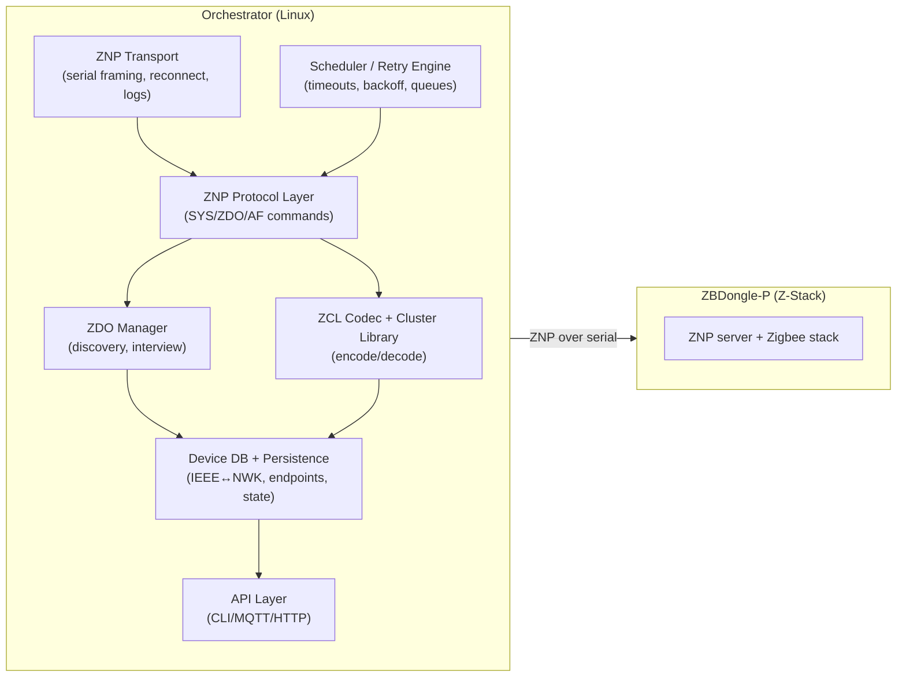

# Zigbee Orchestrator Guide (ZBDongle-P + ZNP + ZCL)

## Goal

This document is a practical, “from zero to productive” guide for building a **low-level Zigbee coordinator/orchestrator application** on Linux using:

- A **Sonoff ZBDongle-P** (TI CC2652P running **TI Z-Stack**) as a **network co-processor** (NCP).
- **ZNP** (Zigbee Network Processor) as the **serial protocol** between host ↔ dongle.
- **ZCL** (Zigbee Cluster Library) as the **application-layer protocol** used to control devices (plugs, bulbs, sensors).

It is written as a tutorial/spec you can hand to new developers so they can:

- Understand the Zigbee stack at a conceptual level (enough to reason about devices and failures).
- Understand the host↔NCP split and what a “coordinator application” really does.
- Run and extend the scripts under `cmd/experiments/zigbee/scripts/`.
- Implement increasingly complex orchestrator behavior: **device discovery**, **control**, **telemetry**, **reporting**, **retries**, **persistence**, and a stable **northbound API**.

This guide intentionally includes:

- Background context for people new to Zigbee.
- Diagrams and message flows.
- Concrete ZNP and ZCL commands actually used in this repository.
- Pseudocode for the orchestrator layers you will build next.

## Context

### What is Zigbee?

Zigbee is a **low-power wireless mesh networking** standard built on IEEE 802.15.4 radios (typically 2.4GHz). Zigbee is common in home automation because it supports:

- **Mesh networking** (devices can route for each other).
- **Low-power end devices** (battery sensors can sleep).
- **Interoperable application semantics** via **ZCL** clusters (e.g., On/Off, Level Control).

Zigbee is not just “radio packets”. It is a stack of layers:

```
Application intent (your app): "turn plug on"
  ↓
ZCL (clusters, attributes, commands)
  ↓
APS (application support: endpoints, addressing, security, fragmentation)
  ↓
NWK (network: routing, addressing, joining)
  ↓
MAC/PHY (802.15.4 radio)
```

### Zigbee roles: coordinator, router, end device

In a Zigbee network:

- **Coordinator**: forms the network (PAN), selects channel and keys, and acts as **Trust Center** (security authority). There is typically **exactly one** coordinator per network.
- **Router**: mains-powered devices that can route traffic (plugs, bulbs). They extend range and robustness.
- **End device**: often battery-powered sensors. End devices can sleep; they attach to a parent router/coordinator.

Your **ZBDongle-P** is a coordinator-capable radio. Many “smart plugs” are actually **routers** because they are mains-powered.

### Two important addresses: IEEE vs NWK

Devices have two primary identifiers:

- **IEEE address** (EUI-64): a globally unique 64-bit identifier. Example: `0x282c02bfffe69870`.
- **NWK address** (short address): a 16-bit network-local address assigned when joined. Example: `0x0038`.

Rule of thumb:

- Treat IEEE as the stable primary key in your database.
- Treat NWK as a cache (it can change on rejoin).

### Endpoints and clusters (the capability model)

Zigbee devices expose capabilities via **endpoints** (like “virtual ports”), each implementing **clusters**.

- Endpoint: `1`, `2`, `242`, etc.
- Cluster: a 16-bit ID. Examples for a power plug:
  - `0x0006` = On/Off (relay control)
  - `0x0B04` = Electrical Measurement (V/A/W, power factor)
  - `0x0702` = Simple Metering (kWh / accumulated energy)

### What is a “coordinator application”?

A coordinator application is the software that turns Zigbee primitives into usable automation behavior:

- Starts/maintains the Zigbee network
- Allows joins (permit-join windows)
- Interviews devices (endpoints/clusters)
- Encodes/decodes ZCL frames
- Maintains a device database
- Exposes a friendly API (MQTT/HTTP/CLI/etc)

**Zigbee2MQTT** is an example coordinator application.

### Host ↔ NCP split (ZBDongle-P + ZNP)

With the Sonoff **ZBDongle-P**, the Zigbee stack runs on the dongle (TI Z-Stack). Your orchestrator runs on Linux and talks to the dongle over serial using **ZNP**:

```
[Your orchestrator app on Linux]
  - device DB
  - ZDO discovery ("interview")
  - ZCL encode/decode
  - policy (retries, timeouts, rules)
  - API (CLI/MQTT/HTTP)
        |
        |  USB serial: ZNP (MT) frames
        v
[ZBDongle-P: TI CC2652P running Z-Stack]
  - 802.15.4 radio
  - NWK/APS/ZDO implementation
  - routing and security primitives
        |
        v
[Zigbee network devices]
```

So “close to the metal” in this architecture means:

- Implementing the **host side** of ZNP (or using a library like `zigpy-znp`)
- Implementing enough **ZDO + ZCL** to discover devices, control them, and consume telemetry

### What this repository implements today

This repo contains an experiment workspace at `cmd/experiments/zigbee/` that provides a reproducible vertical slice:

- Raw ZNP framing demo (`SYS.Ping`) via `pyserial`
- ZNP host via `zigpy-znp` to query coordinator/network state (NIB)
- ZDO discovery: Active Endpoints + Simple Descriptors
- ZCL control: On/Off Toggle via AF
- ZCL attribute read: Read Attributes + parse Read Attributes Response

It does **not yet** implement a full orchestrator (network formation, permit-join, interviews, reporting configuration, persistence schema, etc.). This document explains how to build that next.

## Quick Reference

### Where the code lives (in this repo)

All runnable low-level scripts live in:

- `cmd/experiments/zigbee/scripts/`

Key scripts:

- `cmd/experiments/zigbee/scripts/08-find-coordinator.sh` — find USB/serial path for the dongle
- `cmd/experiments/zigbee/scripts/09-znp-raw-sys-ping.py` — raw ZNP framing using `pyserial`
- `cmd/experiments/zigbee/scripts/04-znp-connect-info.py` — connect via `zigpy-znp`, print coordinator + network info
- `cmd/experiments/zigbee/scripts/05-zdo-discover.py` — ZDO discovery (active endpoints + simple descriptors)
- `cmd/experiments/zigbee/scripts/06-af-send-zcl.py` — send ZCL payloads via `AF.DataRequest` (includes `--onoff toggle`)
- `cmd/experiments/zigbee/scripts/10-zcl-read-attrs.py` — send ZCL Read Attributes and wait for the response (single connection)
- `cmd/experiments/zigbee/scripts/07-af-sniff.py` — AF incoming message printer (serial is exclusive; don’t run alongside senders)

Operational hygiene:

- `cmd/experiments/zigbee/.gitignore` ignores generated Zigbee2MQTT/Mosquitto state, logs, and Python cache.
- `cmd/experiments/zigbee/diary.md` captures the bring-up story and troubleshooting.

### Prerequisites

Hardware:

- Sonoff **ZBDongle-P** (ZNP/Z-Stack, commonly CC2652P)
- At least one Zigbee device joined (for discovery/control), or a coordinator network already formed

Host:

- Linux with access to the dongle serial port
- Prefer stable serial paths:
  - `/dev/serial/by-id/...` rather than `/dev/ttyUSB0`

Python:

- `pyserial` for raw framing script
- `zigpy-znp` for ZNP host scripts

### Golden rule: only one process can own the serial port

Only one program can open `/dev/ttyUSB0` at a time. That means:

- Stop Zigbee2MQTT / Home Assistant / any other coordinator app before running these scripts.
- Don’t run two scripts concurrently unless one doesn’t open the serial port.

### ZNP (MT) frame format (what goes over the wire)

ZNP uses TI’s “MT” framing on UART/USB serial:

```
SOF   LEN   CMD0  CMD1  DATA...  FCS
0xFE  1B    1B    1B    LEN B    1B
```

- `SOF` is always `0xFE`
- `LEN` is the number of bytes in `DATA`
- `CMD0` encodes:
  - `type` (3 bits): SREQ=1, AREQ=2, SRSP=3
  - `subsystem` (5 bits): SYS=0x01, AF=0x04, ZDO=0x05, ...
- `CMD1` is the command ID within the subsystem
- `FCS` is an XOR checksum of `LEN+CMD0+CMD1+DATA`

#### Example: SYS.Ping request (raw bytes)

`SYS.Ping` is a synchronous request (SREQ):

- Subsystem SYS = `0x01`
- Type SREQ = `1`
- `CMD0 = (type<<5) | subsystem = (1<<5) | 0x01 = 0x21`
- `CMD1 = 0x01` (Ping)
- No payload (`LEN=0`)

Bytes sent:

```
fe 00 21 01 20
```

Where `0x20` is the XOR checksum.

`cmd/experiments/zigbee/scripts/09-znp-raw-sys-ping.py` sends that and prints the SRSP.

### ZCL frame format (the “language” devices speak)

ZCL messages are embedded in AF payloads. A minimal ZCL frame (no manufacturer-specific header) looks like:

```
FrameControl  Seq  Cmd  Payload...
1B            1B   1B   ...
```

Key bits in `FrameControl`:

- bits 0-1: frame type (0=foundation, 1=cluster-specific)
- bit 3: direction (0=client→server, 1=server→client)
- bit 4: disable default response

#### Example: On/Off Toggle (cluster-specific)

Cluster `0x0006` (On/Off), command `0x02` (Toggle), no payload.

Example ZCL bytes used by `scripts/06-af-send-zcl.py`:

```
11 bb 02
```

- `0x11`: cluster-specific + disable-default-response
- `0xbb`: ZCL transaction sequence number (ZCL TSN)
- `0x02`: Toggle

#### Example: Read OnOff attribute (foundation Read Attributes)

Read attribute `0x0000` from cluster `0x0006`:

```
10 c9 00 00 00
```

- `0x10`: foundation + disable-default-response
- `0xc9`: ZCL TSN
- `0x00`: Read Attributes command
- `0x0000`: attribute ID (little-endian `00 00`)

The device replies with Read Attributes Response (command `0x01`) including:

- `attr_id (u16)` + `status (u8)` + `type (u8)` + `value`

`cmd/experiments/zigbee/scripts/10-zcl-read-attrs.py` does the request/response in one serial connection.

### ZNP commands used in this work

| Subsystem | Command | Script(s) | Purpose |
|---|---|---:|---|
| SYS | Ping (SREQ/SRSP) | `09-znp-raw-sys-ping.py`, `04-znp-connect-info.py` | Check radio is alive + capabilities |
| SYS | Version (SREQ/SRSP) | `04-znp-connect-info.py` | Read firmware metadata |
| ZDO | StartupFromApp (SREQ/SRSP) | `05-zdo-discover.py`, `06-af-send-zcl.py`, `07-af-sniff.py`, `10-zcl-read-attrs.py` | Ensure stack is started |
| ZDO | ActiveEpReq (SREQ + AREQ callback) | `05-zdo-discover.py` | Get active endpoints for a node |
| ZDO | SimpleDescReq (SREQ + AREQ callback) | `05-zdo-discover.py` | Get clusters per endpoint |
| AF | Register (SREQ/SRSP) | `06-af-send-zcl.py`, `07-af-sniff.py`, `10-zcl-read-attrs.py` | Register host endpoint for AF callbacks |
| AF | DataRequest (SREQ/SRSP + DataConfirm AREQ) | `06-af-send-zcl.py`, `10-zcl-read-attrs.py` | Send AF payload (ZCL inside) |
| AF | IncomingMsg (AREQ callback) | `07-af-sniff.py`, `10-zcl-read-attrs.py` | Receive responses/reports (ZCL inside) |

### ZCL operations used in this work

| Cluster | Operation | Script(s) | Notes |
|---|---|---:|---|
| `0x0006` On/Off | Toggle command (`cmd=0x02`) | `06-af-send-zcl.py` | cluster-specific command |
| `0x0006` On/Off | Read Attributes (`attr=0x0000`) | `10-zcl-read-attrs.py` | foundation cmd `0x00` |

### Quick start commands (copy/paste)

1) Find the dongle path:

```bash
cd cmd/experiments/zigbee
scripts/08-find-coordinator.sh
```

2) Raw ZNP ping:

```bash
python3 scripts/09-znp-raw-sys-ping.py \
  --port /dev/serial/by-id/usb-ITead_Sonoff_Zigbee_3.0_USB_Dongle_Plus_*-if00-port0
```

3) Print coordinator/network info:

```bash
python3 scripts/04-znp-connect-info.py \
  --port /dev/serial/by-id/usb-ITead_Sonoff_Zigbee_3.0_USB_Dongle_Plus_*-if00-port0
```

4) Discover endpoints/clusters on a known node:

```bash
python3 scripts/05-zdo-discover.py \
  --port /dev/serial/by-id/usb-ITead_Sonoff_Zigbee_3.0_USB_Dongle_Plus_*-if00-port0 \
  --nwk 0x0038
```

5) Toggle the plug:

```bash
python3 scripts/06-af-send-zcl.py \
  --port /dev/serial/by-id/usb-ITead_Sonoff_Zigbee_3.0_USB_Dongle_Plus_*-if00-port0 \
  --dst-nwk 0x0038 --dst-ep 1 --onoff toggle
```

6) Read the plug’s current on/off state:

```bash
python3 scripts/10-zcl-read-attrs.py \
  --port /dev/serial/by-id/usb-ITead_Sonoff_Zigbee_3.0_USB_Dongle_Plus_*-if00-port0 \
  --dst-nwk 0x0038 --dst-ep 1 --cluster 0x0006 --attr 0x0000
```

### Architecture: the orchestrator you will build next



## Usage Examples

### Example: end-to-end ZCL attribute read (single connection)

This is the most “orchestrator-like” example because it sends a request and waits for the reply on the same serial connection:

```bash
python3 cmd/experiments/zigbee/scripts/10-zcl-read-attrs.py \
  --port /dev/serial/by-id/usb-ITead_Sonoff_Zigbee_3.0_USB_Dongle_Plus_*-if00-port0 \
  --dst-nwk 0x0038 --dst-ep 1 \
  --cluster 0x0006 --attr 0x0000
```

Expected output shape:

- `AF.DataConfirm` success
- An `AF.IncomingMsg` containing a ZCL Read Attributes Response
- A decoded attribute value (boolean for On/Off)

### Example: “interview” discovery with ZDO

ZDO discovery is the first step in turning a joined node into a usable device model:

```bash
python3 cmd/experiments/zigbee/scripts/05-zdo-discover.py \
  --port /dev/serial/by-id/usb-ITead_Sonoff_Zigbee_3.0_USB_Dongle_Plus_*-if00-port0 \
  --nwk 0x0038
```

This prints:

- active endpoints (e.g. `[1, 242]`)
- per-endpoint:
  - profile ID (usually `0x0104` for Home Automation)
  - device ID (device type)
  - input clusters (server clusters you can command/read)
  - output clusters (client clusters the device sends)

### Example: control with raw ZCL payloads

If you want to handcraft ZCL frames yourself:

```bash
python3 cmd/experiments/zigbee/scripts/06-af-send-zcl.py \
  --port /dev/serial/by-id/usb-ITead_Sonoff_Zigbee_3.0_USB_Dongle_Plus_*-if00-port0 \
  --dst-nwk 0x0038 --dst-ep 1 \
  --cluster 0x0006 \
  --data-hex 0x11bb02
```

Where `0x11bb02` is “Toggle” in ZCL for the On/Off cluster.

### Example: raw ZNP ping framing

```bash
python3 cmd/experiments/zigbee/scripts/09-znp-raw-sys-ping.py \
  --port /dev/serial/by-id/usb-ITead_Sonoff_Zigbee_3.0_USB_Dongle_Plus_*-if00-port0
```

It prints the bytes sent and the parsed response header/payload.

## Tutorial / Spec (deep dive)

This section is long-form. New developers should read it once, then use the scripts as concrete references.

### 1) Project layout and how to run safely

Work directory:

- `cmd/experiments/zigbee/`

Port ownership rules:

- Only one process can open the port at a time.
- Stop Zigbee2MQTT/Home Assistant before running scripts.

Port contention symptoms:

- `PermissionError: The serial port is locked by another application`
- `BlockingIOError: [Errno 11] Resource temporarily unavailable`

### 2) ZNP protocol: framing and command semantics

#### 2.1 Frame parsing pseudocode

The raw framing used in `scripts/09-znp-raw-sys-ping.py`:

```pseudo
read_byte() until SOF=0xFE
LEN = read_u8()
CMD0 = read_u8()
CMD1 = read_u8()
DATA = read_exact(LEN)
FCS  = read_u8()
assert FCS == xor(LEN, CMD0, CMD1, DATA...)
```

#### 2.2 Command header bits

`CMD0`:

```text
bits 7..5: command type (SREQ=1, AREQ=2, SRSP=3)
bits 4..0: subsystem (SYS=0x01, AF=0x04, ZDO=0x05, ...)
```

Common command types you will see:

- `SREQ`: host request expecting immediate SRSP
- `SRSP`: response to SREQ
- `AREQ`: unsolicited callback/indication

#### 2.3 The “one SREQ at a time” rule

In practice, a coordinator host should send **one SREQ at a time** and wait for its SRSP. Libraries implement locks to enforce this.

If you implement your own host:

- implement an async request queue
- correlate on expected response header (and sometimes payload parameters)

### 3) ZDO discovery: endpoints and clusters (“interview”)

ZDO lets you ask a node:

- Which endpoints do you have?
- For each endpoint, which clusters do you implement?

Minimal interview algorithm:

```pseudo
on_device_joined(ieee, nwk):
  eps = ZDO.ActiveEpReq(nwk)
  for ep in eps:
    sd = ZDO.SimpleDescReq(nwk, ep)
    record(ep.profile, ep.device_type, sd.input_clusters, sd.output_clusters)
  choose control endpoint where 0x0006 in input_clusters
```

In this repo, `scripts/05-zdo-discover.py` implements this flow using `zigpy-znp`’s `request_callback_rsp` helper.

### 4) ZCL: encoding/decoding the application language

ZCL has two families:

- Foundation commands (frame type 0): Read Attributes, Configure Reporting, etc.
- Cluster-specific commands (frame type 1): On/Off/Toggle, etc.

#### 4.1 ZCL frame control

```text
bit 0-1: frame type
bit 2: manufacturer specific
bit 3: direction
bit 4: disable default response
```

Setting “disable default response” reduces noise in orchestrators.

#### 4.2 Read Attributes Response parsing

The body is a list of records:

```
attr_id(u16le) status(u8) [type(u8) value(...)]
```

`scripts/10-zcl-read-attrs.py` contains a minimal type-length table and decoders for common numeric types used by plugs.

### 5) AF: transporting ZCL frames

The AF subsystem provides:

- `AF.Register` to register a local endpoint (so callbacks have a destination)
- `AF.DataRequest` to send an application payload (ZCL inside)
- `AF.DataConfirm` callback reporting send status
- `AF.IncomingMsg` callback containing incoming payloads (ZCL inside)

Important distinction:

- `AF.DataConfirm SUCCESS` means “the stack sent it / accepted it (and may have gotten an APS ACK)”
- it does not guarantee the device changed state unless you confirm via a read/report

### 6) Device DB and persistence (what you must own)

A real orchestrator must persist:

- network identity: PAN/channel/extPAN and keys
- coordinator identity + firmware metadata
- device identities: IEEE ↔ current NWK mapping
- endpoint + cluster model
- per-device scaling/calibration (e.g., power multiplier/divisor)
- optional last-known state + timestamps

This repo also used Zigbee2MQTT’s JSONL DB at:

- `cmd/experiments/zigbee/data/database.db` (ignored by git; do not commit)

### 7) Reliability: retries, timeouts, sleepy devices

Minimal retry policy:

- If `AF.DataConfirm` indicates failure, retry with backoff.
- If you expect an application response (e.g. Read Attributes Response) and timeout, retry.

In-flight correlation keys:

- (dst IEEE, dst EP, cluster, ZCL TSN) for ZCL-level expectations

### 8) Security notes (trust center, keys)

At minimum understand:

- the network key encrypts most traffic
- the trust center distributes the network key during join
- frame counters matter; losing them can break communications

Scripts default to setting AF “ENABLE_SECURITY” on outgoing frames to match typical coordinator behavior.

## Work Performed in This Repo (Concrete Walkthrough)

This section documents the exact “vertical slice” we brought up, including the concrete ZNP/ZCL commands and the observed outputs. This is useful for new developers because it provides a known-good baseline to compare against.

### Hardware + environment facts

- Coordinator: Sonoff ZBDongle-P (USB UART bridge shows as Silicon Labs CP210x; Zigbee stack is TI Z-Stack speaking ZNP)
- Host OS: Linux
- Serial port: stable path under `/dev/serial/by-id/...` pointing at `/dev/ttyUSB0`
- Python: this repo’s environment includes `zigpy-znp` and `pyserial`

### The test device we controlled

During pairing, the joined device was identified as:

- **Third Reality Zigbee / BLE smart plug with power** (`modelId: 3RSP02028BZ`)

It joined as a **router** and received:

- IEEE: `0x282c02bfffe69870`
- NWK: `0x0038`

From ZDO discovery we observed:

- Active endpoints: `[1, 242]`
- Endpoint `1` (Home Automation profile `0x0104`) includes:
  - `0x0006` On/Off
  - `0x0B04` Electrical Measurement
  - `0x0702` Simple Metering

### Step A: Raw ZNP ping (no library)

Script:

- `cmd/experiments/zigbee/scripts/09-znp-raw-sys-ping.py`

ZNP command:

- SYS.Ping (SREQ id `0x01`, subsystem SYS `0x01`)

Raw bytes:

```
fe 00 21 01 20
```

Response parsing:

- `CMD0=0x61` indicates SRSP in SYS subsystem (`0x60 | 0x01`)
- payload contains “capabilities” (width varies by firmware; we observed 2 bytes in this environment)

### Step B: Connect and read coordinator/network info (zigpy-znp)

Script:

- `cmd/experiments/zigbee/scripts/04-znp-connect-info.py`

ZNP commands/operations:

- SYS.Ping
- SYS.Version
- Read NVRAM items (Z-Stack OSAL) for:
  - EXTADDR (coordinator IEEE)
  - NIB (Network Information Base: PAN/channel/extPAN/etc)

Typical (sanitized) output fields include:

- Z-Stack feature-detected version (we observed `3.3`)
- firmware metadata (`SYS.Version`)
- `pan_id`, `ext_pan_id`, `channel`
- `nwk_key_loaded` (boolean; key bytes are not printed unless explicitly requested)

### Step C: ZDO discovery (“interview”)

Script:

- `cmd/experiments/zigbee/scripts/05-zdo-discover.py`

ZNP commands:

- ZDO.StartupFromApp (to ensure stack is started)
- ZDO.ActiveEpReq (SREQ)
  - ZDO.ActiveEpRsp (AREQ callback)
- ZDO.SimpleDescReq (SREQ, per endpoint)
  - ZDO.SimpleDescRsp (AREQ callback)

This maps a node into a concrete capability model:

- endpoints
- per-endpoint profile/device type
- cluster lists (input/server clusters; output/client clusters)

### Step D: Send a ZCL command (On/Off Toggle)

Script:

- `cmd/experiments/zigbee/scripts/06-af-send-zcl.py`

ZNP commands:

- ZDO.StartupFromApp
- AF.Register (so callbacks have a destination endpoint)
- AF.DataRequest
  - AF.DataConfirm (AREQ callback)

ZCL payload used for Toggle:

```
11 <zcl_tsn> 02
```

We confirmed delivery by observing:

- `AF.DataConfirm` with `Status.SUCCESS`

### Step E: Read an attribute and parse the response (single connection)

Script:

- `cmd/experiments/zigbee/scripts/10-zcl-read-attrs.py`

ZNP commands:

- ZDO.StartupFromApp
- AF.Register
- AF.DataRequest
  - AF.DataConfirm callback
  - AF.IncomingMsg callback containing the ZCL response

ZCL request payload (Read Attributes: OnOff `0x0006` / attribute `0x0000`):

```
10 <zcl_tsn> 00 00 00
```

ZCL response payload shape (Read Attributes Response):

```
18 <zcl_tsn> 01 00 00 00 10 <value>
```

Where:

- `0x18` indicates foundation + server→client direction + disable-default-response
- `0x01` is Read Attributes Response
- record: attr `0x0000`, status `0x00`, type `0x10` (boolean), value `0x00` or `0x01`

## ZNP Command Reference (Used Here)

This section provides a concrete mapping between ZNP concepts and what you’ll see on the wire. Command IDs listed here correspond to the Z-Stack ZNP MT command set (and are reflected in `zigpy-znp`’s command definitions).

### Subsystems

The scripts primarily use:

- SYS (`0x01`): system ping/version
- AF (`0x04`): endpoint registration and data send/receive
- ZDO (`0x05`): discovery, startup, management

### Command types

- SREQ (`1`) → synchronous request
- SRSP (`3`) → synchronous response
- AREQ (`2`) → asynchronous callback/indication

`CMD0 = (type<<5) | subsystem`

So the common CMD0 values you’ll see are:

- SYS:
  - SREQ: `0x21`, SRSP: `0x61`, AREQ: `0x41`
- AF:
  - SREQ: `0x24`, SRSP: `0x64`, AREQ: `0x44`
- ZDO:
  - SREQ: `0x25`, SRSP: `0x65`, AREQ: `0x45`

### Concrete commands and IDs

| Subsystem | Command | CMD1 | Type | Notes |
|---|---|---:|---:|---|
| SYS | Ping | `0x01` | SREQ/SRSP | Capabilities bitmask |
| SYS | Version | `0x02` | SREQ/SRSP | Firmware metadata |
| ZDO | StartupFromApp | `0x40` | SREQ/SRSP | Ensure stack started |
| ZDO | ActiveEpReq | `0x05` | SREQ | Triggers ActiveEpRsp callback |
| ZDO | ActiveEpRsp | `0x85` | AREQ | Contains endpoint list |
| ZDO | SimpleDescReq | `0x04` | SREQ | Triggers SimpleDescRsp callback |
| ZDO | SimpleDescRsp | `0x84` | AREQ | Contains simple descriptor |
| AF | Register | `0x00` | SREQ/SRSP | Register local endpoint |
| AF | DataRequest | `0x01` | SREQ/SRSP | Send application payload |
| AF | DataConfirm | `0x80` | AREQ | Send completion status |
| AF | IncomingMsg | `0x81` | AREQ | Incoming application payload |

## ZCL Reference (Used Here)

### Cluster IDs used in our examples

| Cluster | ID | Category |
|---|---:|---|
| Basic | `0x0000` | identification |
| Identify | `0x0003` | identification |
| Groups | `0x0004` | grouping |
| Scenes | `0x0005` | grouping |
| On/Off | `0x0006` | control |
| Electrical Measurement | `0x0B04` | telemetry |
| Simple Metering | `0x0702` | telemetry |

### ZCL foundation command IDs used here

| Command | ID |
|---|---:|
| Read Attributes | `0x00` |
| Read Attributes Response | `0x01` |

### ZCL On/Off cluster-specific command IDs used here

| Command | ID |
|---|---:|
| Off | `0x00` |
| On | `0x01` |
| Toggle | `0x02` |

## Script-by-Script Notes (How the Code Works)

This section is a guided tour of the scripts. The intent is to show the structure you will reuse when building a real orchestrator, and to clarify the “gotchas” encountered during development.

### `scripts/08-find-coordinator.sh`

Purpose:

- Make it obvious whether the dongle is actually attached, and what stable serial path to use.

What it does:

- `lsusb` filtered for common Zigbee dongle signatures (including `10c4:ea60` CP210x)
- lists `/dev/serial/by-id` symlinks
- lists `/dev/ttyUSB*` and `/dev/ttyACM*` devices

Operational note:

- Prefer `/dev/serial/by-id/...` when starting a long-running orchestrator so reconnects don’t break you if the kernel re-enumerates the USB device.

### `scripts/09-znp-raw-sys-ping.py`

Purpose:

- Demonstrate ZNP framing without any dependency on `zigpy-znp`.

Key code shape:

- `build_sys_ping_req()` constructs the frame:
  - `SOF=0xFE`, `LEN=0`, `CMD0=0x21`, `CMD1=0x01`, `FCS=xor(...)`
- `read_frame()` parses:
  - scans for SOF
  - reads LEN/header/payload/FCS
  - validates XOR checksum

Why you want this:

- When a higher-level library “can’t connect”, this script helps you answer:
  - Is the port correct?
  - Is the dongle alive?
  - Is framing/baudrate sane?

### `scripts/04-znp-connect-info.py`

Purpose:

- Connect via `zigpy-znp` and print coordinator + network parameters you should persist.

Key ZNP operations:

- `SYS.Ping` and `SYS.Version`
- NVRAM reads:
  - NIB (network identity)
  - EXTADDR (coordinator IEEE)

Important safety switches:

- `--show-keys` prints the network key; treat output as sensitive.
- `--pin-toggle-skip-bootloader` enables RTS/DTR toggling; off by default.

Implementation note:

- `zigpy-znp` has a built-in “skip bootloader/reset” pin toggling sequence controlled by `CONF_SKIP_BOOTLOADER`. Our scripts default this off for safety/repeatability; enable it only if your dongle needs it to respond reliably.

### `scripts/05-zdo-discover.py`

Purpose:

- Implement the minimal “interview” required to turn a node into a useful model: endpoints and clusters.

Key ZNP details:

- Uses `request_callback_rsp` so you don’t miss callbacks due to UART chunking (SRSP and AREQ can arrive in the same read).

Gotcha that bit us:

- `zigpy.zdo.types.SimpleDescriptor` uses snake_case field names:
  - `desc.input_clusters` / `desc.output_clusters`
  - `desc.profile` / `desc.device_type` / `desc.device_version`

### `scripts/06-af-send-zcl.py`

Purpose:

- Send ZCL payloads (raw) using AF.

Key operations:

- `AF.Register` registers a “controller endpoint” (`--src-ep`, default 20).
- `AF.DataRequest` sends the ZCL payload as the AF data.
- `AF.DataConfirm` indicates send status.

Important details:

- The “AF TSN” in `AF.DataRequest` is not the same as the “ZCL TSN” inside the ZCL payload.
- Options commonly used:
  - `ACK_REQUEST` (APS ACK)
  - `ENABLE_SECURITY` (APS security)

### `scripts/10-zcl-read-attrs.py`

Purpose:

- A single-process send+receive “mini orchestrator” for Read Attributes.

Why it exists:

- Serial is exclusive: you cannot run a separate sniffer while also sending from another process.

What it demonstrates:

- Registering an endpoint that can both send and receive
- Sending a ZCL request
- Waiting for `AF.IncomingMsg` matching (src nwk, src ep, dst ep, cluster)
- Parsing the ZCL response and decoding common data types

## Orchestrator Design Spec (What To Build Next)

This section describes an opinionated but practical architecture you can implement in a real service, using the scripts as reference implementations for individual “moves”.

### Core components and responsibilities

1) ZNP transport

- Open/close/reconnect serial
- Raw framing encode/decode
- Structured logging of frames (optional)
- Backpressure and write coalescing

2) ZNP command layer

- Encode/decode SYS/ZDO/AF commands
- Provide an async request API with:
  - “one SREQ at a time” enforcement
  - request timeouts
  - SRSP validation
- Route AREQ callbacks to subscribers

3) ZDO manager

- Device join/rejoin tracking
- Discovery/interview state machine:
  - node descriptor
  - active endpoints
  - simple descriptors
  - basic cluster reads (manufacturer/model)

4) ZCL codec + cluster library

- Encode/decode ZCL headers and payloads
- Implement minimal primitives:
  - On/Off control
  - Read/Write attributes
  - Configure reporting
  - Parse attribute reports

5) Device database + persistence

- IEEE primary key; NWK as mutable field
- Endpoint/cluster model
- Per-attribute scaling metadata (multiplier/divisor)
- Last-seen timestamps
- Network parameters + key material + frame counters

6) Scheduler/retry engine

- Retries with exponential backoff + jitter
- “sleepy device” queues
- Rate limiting (avoid flooding the mesh)

7) Northbound API

- Stable external interface (MQTT/HTTP/gRPC/CLI)
- Device naming abstraction (friendly name instead of IEEE in every call)

### Minimal vertical slice for a production service

If you want “just enough” to control plugs and read power:

1. Ensure coordinator network exists and is started
2. Permit join and accept a router/end device
3. Interview (ZDO + Basic cluster)
4. Identify the endpoint supporting:
   - On/Off (`0x0006`)
   - Electrical Measurement (`0x0B04`) or Metering (`0x0702`)
5. Control:
   - send On/Off/Toggle
6. Telemetry:
   - read multiplier/divisor and active power/voltage/current
   - configure reporting for those attributes

## Next Steps (Suggested Enhancements)

- Add `Configure Reporting` support (ZCL foundation cmd `0x06`) for:
  - `0x0B04` Electrical Measurement activePower/voltage/current
  - `0x0702` metering attributes (sum of delivered energy)
- Add a script to decode `Report Attributes` (foundation cmd `0x0A`)
- Add “permit join” script using `ZDO.MgmtPermitJoinReq`
- Add a small persistent device DB owned by this orchestrator (SQLite or JSON + migrations)
- Add a long-running daemon mode that:
  - maintains a single ZNP connection
  - exposes a CLI/HTTP endpoint for “toggle/read power”
  - logs all incoming AF.IncomingMsg frames

## Related

- Ticket index: `ttmp/2026/01/04/ADD-ZIGBEE-CONTROL-001--zigbee-low-level-znp-zcl-orchestrator-guide/index.md`
- Bring-up diary: `cmd/experiments/zigbee/diary.md`
